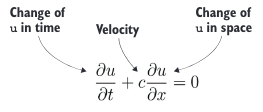
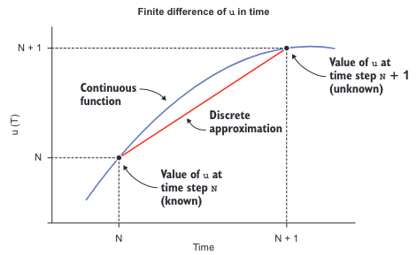
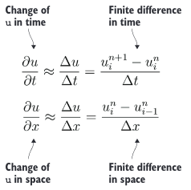
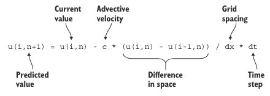

# 附录 A 设置 Fortran 开发环境 

在我们深入代码之前，让我们先了解一下编辑、编译和运行 Fortran 程序的基础知识。我会推荐一些我喜欢的文本编辑器，并指导您设置完整的 Fortran 开发环境。如果您熟悉 Docker 并且想跳过所有繁琐的设置步骤，请直接跳转到第 A.4 节，在那里我会介绍如何获取现代 Fortran Dockerfile，让您立即上手。

## A.1 编辑 Fortran 源文件 

您将编写 Fortran 程序和模块作为纯文本文件。您可以在您喜爱的文本编辑器中编辑它们。以下是一些流行的选择： 

- Vim（Vi IMproved，[https://www.vim.org/](https://www.vim.org/)）是轻量级且功能强大的编辑器，对于初学者来说有一定的学习曲线。这是我个人的选择。我在 2006 年开始编程时开始使用它，从那时起就再也没有换过其他编辑器。
- Emacs（[https://www.gnu.org/software/emacs](https://www.gnu.org/software/emacs)）是一个功能强大且可扩展的编辑器，也是仍然在主流使用中的最古老的应用程序之一。
- Atom（[https://atom.io](https://atom.io)）是由 GitHub 开发的现代、功能丰富的集成开发环境。Atom 还具有一个内置的包管理器，可以向编辑器添加第三方功能。
- Visual Studio Code（[https://code.visualstudio.com](https://code.visualstudio.com)）是另一个现代的、功能齐全的集成开发环境，类似于 Atom。在选择文本编辑器时，一个重要的特性是它是否可以用不同颜色突出显示 Fortran 语法。我列出的所有编辑器都可以做到，无论是开箱即用还是通过扩展。它们还都是免费且开源的，因此如果您还没有喜欢的编辑器，我建议您尝试每一个，并看看哪一个最舒适。

> **Fortran 源文件的扩展名**
> 
> 虽然 Fortran 标准对 Fortran 源文件的扩展名没有强加任何约束，但编译器供应商已经采用了几乎通用的一套规则：
>
> - 带有后缀 .f、.for 或 .ftn 的文件名被解释为固定格式（FORTRAN 77 及更早版本）的代码。
> - 带有后缀 .f90、.f95、.f03 或 .f08 的文件被解释为自由格式。
> - 带有大写后缀（例如 .F 或 .F90）的文件提示编译器对文件进行预处理。
>
> 本书中编写的所有代码都是自由格式的。自由格式简单地指的是在 Fortran 90 标准中引入的更自由的语法。由于我所知道的所有编译器都支持 .f90 作为自由格式代码的通用后缀（例如，Intel 编译器默认不支持 .f95、.f03 或 .f08），因此我们将在整本书中都使用这个扩展名。

## A.2 设置 Fortran 编译器

有几个高质量的 Fortran 编译器可供选择。大多数由商业供应商如英特尔、Cray 等开发和维护。如果你能使用其中之一，那就太好了！在阅读本书时，可以随意使用它们。当然，对于任何特定于编译器的设置或使用说明，你需要参考你编译器的文档。

另外，作为 GNU 编译器集合（GCC）的一部分，还提供了一个免费、开源的 Fortran 编译器，即 GNU Fortran 编译器（gfortran，[https://gcc.gnu.org/fortran](https://gcc.gnu.org/fortran)）。在本书的示例和练习中，我们将使用 GNU Fortran 编译器。与其他编译器相比，gfortran 的优点包括：

- 免费下载、使用和修改
- 在大多数操作系统上易于安装
- 处于积极开发阶段
- 实现了大多数标准特性，包括一些来自最新的 Fortran 2018 标准

在编写本书时，出现了更多的开源编译器，并且仍在积极开发中。特别是，可以留意 LFotran（[https://lfortran.org](https://lfortran.org)）和 Flang（[https://github.com/flang-compiler/flang](https://github.com/flang-compiler/flang)）。

### Linux

在大多数 Linux 系统上，可以通过系统软件包管理器轻松安装 gfortran，而无需访问外部资源。在基于 DEB 的系统（如 Debian 或 Ubuntu）上，安装 gfortran 就像执行
 ```bash
 apt install gfortran 
 ```
 一样简单。该命令会为您解决下载和安装步骤，一旦命令执行完成，gfortran 就可用了。在基于 RPM 的系统（如 Fedora 或 CentOS）上，您可以这样安装 gfortran：dnf install gcc-gfortran。或者，如果 gfortran 在系统的软件包管理器中不可用，您可以从 [https://gcc.gnu.org/wiki/GFortranBinaries](https://gcc.gnu.org/wiki/GFortranBinaries) 下载二进制文件。

 > **权限**
 > 您需要管理员（root）权限才能使用软件包管理器安装编译器。如果您知道自己在做什么，并且您的用户名已经在sudoers列表中，只需在我提供的Linux安装命令前加上sudo即可。

### macOS

对于 macOS，我建议您使用 homebrew 包管理器（[https://brew.sh](https://brew.sh)）。一旦在您的系统上设置了 homebrew，安装 Fortran 编译器就像执行
```bash
 brew install gcc
 ```
 这个命令一样简单。该命令将安装基本的 GNU Compiler Collection 以及 Fortran 编译器。

### Windows
在 Windows 中设置开发环境最简单的方法是通过 Windows 子系统来运行 Linux。这是一个在 Windows 10 操作系统中原生运行的 Ubuntu Linux 实例。如果您的 Windows 10 已经更新到最新版本，您可以从 Windows 应用商店获取 Ubuntu Linux 系统。一旦您安装好并运行起来，安装 Fortran 编译器就很容易了：
```bash
apt install gfortran
```
否则，有些人成功地在 Windows 上使用 Cygwin（[https://www.cygwin.com](https://www.cygwin.com)）来开发 Fortran。

### A.3 设置 MPI 库（消息传递接口）

在第 1 章中，我使用了一个处理器之间的数据复制示例来演示使用 MPI 进行并行编程。虽然在本书中我们将专注于使用 Coarray Fortran（CAF）进行并行算法，但我们仍然需要安装 MPI 库，因为它是 GNU 编译器在使用 coarrays 时的一个依赖项（请参阅“设置 OpenCoarrays”部分）。

我推荐使用 OpenMPI（https://www.open-mpi.org）或 MPICH（https://www.mpich.org）作为流行、高质量且易于使用的 MPI 实现。它们可以通过 Linux 包管理器安装。例如，如果您使用 Ubuntu 或其他基于 Debian 的发行版，您可以使用以下命令安装 OpenMPI：

```bash
apt install openmpi-bin libopenmpi-dev 
```
在基于 RPM 的发行版（如 Fedora 或 CentOS）上，输入以下命令：
```bash
dnf install openmpi openmpi-devel 
```

安装完成后，MPI 库会为编译器提供一个可执行包装器。如果安装正确，您可以通过在命令提示符下输入 mpif90 来验证：
```bash
mpif90 
gfortran: fatal error: no input files compilation terminated. 
```
不要担心这个错误消息。这只是意味着 mpif90 在幕后正确调用了 gfortran，并且我们没有向它传递任何源文件。

## A.4 设置 OpenCoarrays

OpenCoarrays（[http://www.opencoarrays.org](http://www.opencoarrays.org)）提供了 GNU Fortran 编译器和底层并行实现（在我们的案例中是 MPI）之间的接口；你不需要知道更多。把它想象成 gfortran 的一个扩展，它将允许你使用 coarrays 构建和运行并行程序。如果你已经可以访问带有 Intel 或 Cray 编译器套件的计算平台，你就不需要 OpenCoarrays，可以跳到下一节。

### Linux

直接从其 GitHub 仓库获取 OpenCoarrays 发行版：

```bash
git clone --branch 2.9.0 https://github.com/sourceryinstitute/OpenCoarrays
```

通过源代码构建 OpenCoarrays 是最简单快速的方式。考虑到我们已经构建了 gfortran 和 OpenMPI，编译 OpenCoarrays 相对来说比较简单：

```bash
cd OpenCoarrays 
mkdir build 
cd build
FC=gfortran CC=gcc cmake .. 
make 
make install
```

你还需要 CMake（[https://cmake.org](https://cmake.org)）来构建 OpenCoarrays，并且需要 root 权限在你的系统上执行 make install。截至本文撰写时，OpenCoarrays 的最新版本是 2.9.0。然而，保持关注他们的发布页面（[http://mng.bz/eQBG](http://mng.bz/eQBG)），如果有更新版本的话，请下载最新版本。

### macOS

在 macOS 上使用 brew 安装 OpenCoarrays 非常简单：

```
brew install opencoarrays
```

### 使用 OpenCoarrays

OpenCoarrays 提供两个可执行文件：

- `caf` — 用于编译 Coarray Fortran 程序的包装脚本
- `cafrun` — 用于运行 Coarray Fortran 程序的包装脚本

编译 CAF 程序时，我们将使用 `caf` 作为我们的编译器的替代品；例如：

```
caf array_copy_caf.f90 -o array_copy_caf
```

要运行 CAF 程序，您将使用 `cafrun` 脚本调用它：

```
cafrun -n 2 array_copy_caf
```

此命令在两个并行进程上调用 `array_copy_caf` 程序。如果计算机上有两个物理处理器，则两者都将被使用。否则，`cafrun` 将在同一处理器上生成两个并行线程运行。这些细节不会影响程序的语义。

> **为什么我们需要 OpenCoarrays？**
> 
> Gfortran 完全支持 2008 年标准的 Fortran Coarray 语法。然而，单独使用 gfortran 还没有内置的机制来进行使用 coarrays 的并行计算。这意味着，使用普通的 gfortran，您可以编译 coarray 程序，但只能以单个图像（串行）模式运行它们。虽然这对于早期开发和测试可能很有用，但我们需要能够在多个图像上并行运行我们的程序。这就是 OpenCoarrays 的作用所在。
> 
> 请注意，只有当您使用 gfortran 时才需要 OpenCoarrays。如果您使用的系统已经配置了 Intel 或 Cray 编译器套件，则可以使用构建 Coarray Fortran 代码。

## A.5 构建 Docker 镜像

如果您熟悉 Docker，并希望跳过所有这些繁琐的设置，直接开始操作，请从 http://mng.bz/pBZR 下载 Dockerfile。要构建现代 Fortran 镜像，请键入：

```
docker build . -t modern-fortran:latest
```

此步骤需要一段时间，因为 Docker 将拉取基本操作系统镜像，并使用本书中的编译器、依赖项和 Fortran 代码设置镜像。一旦完成，如果构建成功，您将能够看到新的镜像；例如：

```
docker images
REPOSITORY           TAG       IMAGE ID       CREATED          SIZE
modern-fortran       latest    0e5c745c8928   6 minutes ago    546MB
```

要运行它，请键入：

```
docker run -it modern-fortran:latest /bin/bash
```

然后您就可以开始了！

# 附录 B 从微积分到代码

在这里，我将花一些时间解释我们究竟是如何从偏微分方程转化为实际的 Fortran 代码，这些代码将计算出解决方案。本附录为离散化偏导数并将其转化为计算机代码奠定了基础。

## B.1 平流方程解释

回顾一下，我们在第2章的目标是编写一个程序，该程序将预测由稳定背景流引起的物体运动。程序的结果应与图2.2中的草图一致。在第2.2.2节的冷锋练习中，我要求您计算冷锋上的温度梯度以及迈阿密温度下降的速度，考虑到锋前的传播速度。当您做练习时，您可能没有意识到您解决了线性平流方程（图 B.1）。


> **图 B.1** 线性一维平流方程。$u$ 是空间 $x$ 和时间 $t$ 中被平流的数量，$c$ 是恒定的平流速度。$u$ 可以代表任何数量，包括温度、污染物浓度或速度本身。

该方程说明了时间上 $u$ 的变化率等于空间梯度 $\partial{u}$ 乘以平流速度 $c$。

$\frac{\partial{u}}{\partial{t}}$ 与$\frac{\partial{u}}{\partial{x}}$是所谓的偏导数，它们分别表示了 $u$ 在时间和空间上的变化。如果用温度替换 $u$，这就等同于我们之前的例子：冷锋接近迈阿密时，迈阿密温度的降低速率等于冷锋前的温度梯度乘以冷锋的传播速度。温度梯度更陡的前沿，或者传播速度更快的前沿，会使温度下降得更快。如果我们能够将这个计算表达成代码，它就可以适用于任何量。

### B.1.1 将导数离散化

现今的计算机无法进行微积分运算。事实上，在 CPU 层面，它们做的不过是对数字进行加法和乘法运算，并在内存中移动位和字节。甚至像减法和除法这样的简单算术运算也是从加法和乘法推导而来的。如果我们只有基本的算术运算，那么我们如何解决偏微分方程呢？一种方法是用能够用代码表达的形式来近似表示偏导数。这通常通过将偏导数进行离散化来实现，将它们表达为离散值的算术表达式。

> **什么是离散化？**

> 维基百科将离散化定义为“将连续函数、模型、变量和方程转换为离散对应物的过程。这个过程通常作为将它们适合进行数字评估和在数字计算机上实现的第一步。” 
> 
> 更简单地说，这是一种将连续函数（例如图 B.1 中的函数）转换为计算机可以接受并处理的数字的方法。


在冷锋练习中，当你计算穿过冷锋的温度梯度时，你使用了所谓的有限差分方法来近似导数。你可能会想到这样的想法：“温度梯度等于迈阿密的温度减去亚特兰大的温度，再除以迈阿密和亚特兰大之间的距离。”更一般地，这种方法可以如图 B.2 所示。

取任何连续函数 $u$ 作为例子，例如迈阿密的空气温度或者我们的斑块的高度。这个函数随时间变化，并且被表示为实线曲线。在当前时间（时间步 $n$），我们知道 $u$ 的值。我们不知道的是，并且正在尝试计算的是未来时间（时间步 $n+1$）的 $u$ 的值。有限差分方法将连续函数（曲线）简化为离散的近似（直线）。我使用“离散”这个词是因为这条线可以由起点和终点确定，这些可以在计算机代码中表示。

为了与我们的冷锋例子联系起来，这里的红色线条的斜率对应于温度梯度乘以传播速度。传播速度或梯度越高，直线就越陡峭。同样的方法适用于任何空间或时间中的任何量的偏导数。我们将使用这个规则将方程中的所有项都表示为离散变量。

现在我们知道了离散化偏导数的一般规则，我们可以将其应用于方程中的每个导数（图 B.3）。


> **图 B.2** 时间上 $u$ 的有限差分。连续函数 $u(t)$ 的时间导数被近似为时间步 $n+1$ 和 $n$ 处 $u$ 的值的差异，除以这两个点之间的时间间隔。


> **图 B.3**  使用有限差分近似平流方程中的偏导数。顶部方程近似了时间上 $u$ 的变化（趋势），底部方程近似了空间上 $u$ 的变化（梯度）。最右侧的所有项都可以用计算机程序中的变量表示。离散的时间和空间指数分别表示为 $n$ 和 $i$。

在这里，我们用有限差分法离散化了每个导数（时间和空间）。首先，我们说明时间上 $u$ 的变化率（趋势）可以近似为时间上 $u$ 的差异除以时间步长（$\Delta u/ \Delta t$）。类似地，空间上 $u$ 的变化率（梯度）可以近似为空间上 $u$ 的差异除以网格间距（$\Delta u/\Delta x$）。在每个方程的最右边，我们有 $u$ 的时间和空间导数的有限差分形式。按照惯例，上标 $n$ 和 $n+ 1$ 分别指代当前和未来的时间步长。下标 $i$ 指代空间网格上的位置，这将映射到我们Fortran数组中的元素。

> **差分的顺序**
> 
> 注意，在时间上我们使用的是向前差分 $(u_i^{n+1}-u_i^n)$，而在空间上我们使用的是向后（上游）差分 $(u_i^n-u_{i-1}^n)$。在时间上的向前差分是估计下一个时间步长 $(u_i^{n+1})$ 的最简单模式，这也是我们所寻求的值。空间上的差分是相对于流速 c 向上游取向的。如果速度是正的，流动是从左到右的。因此，为了捕捉从左边进入的物体，我们需要沿着那个方向取差分。如果物体是从右到左移动（c 的值为负），我们需要将空间上的差分切换为 $u_{i+1}^{\prime\prime}-u_{i}^{\prime\prime}$。

### B.1.2 将导数转化为代码

现在我们已经将所有的项都以离散形式写出，那么我们如何编写代码来求解下一个时间步长的 $u$ ，即 u(i,n+1)？尝试重新排列我们已经写出的离散项，使得 u(i,n+1) 在左边，而所有其他项都在右边。你能将这个表达式转化为代码吗？图 B.4 展示了我的尝试。


> **图 B.4** 我们平流求解器的代码原型。为了计算预测值 u(i,n+1)，我们取空间上的差 u(i,n) - u(i-1,n)，除以网格间距 dx，乘以平流速度 c 和时间步长 dt，最后从当前值 u(i,n) 中减去。

对我来说，阅读这个方程式最简单的方式是：
1. 取空间上的差，u(i,n) - u(i-1,n)。类似于第二章中的冷锋练习，这相当于问：“迈阿密和亚特兰大的温差是多少？”
2. 将差除以网格间距 dx。这给出了梯度 (u(i,n) - u(i-1,n)) / dx；即，空间上的变化率。
3. 将梯度乘以传播速度 c。这给出了倾向 c * (u(i,n) - u(i-1,n)) / dx；即，时间上的变化率。
4. 最后，我们将倾向乘以时间步长并加到当前值上。

> **仅保留当前时间级别在内存中**
>
> 为了清晰起见，我将 u 写成了一个二维数组，其空间维度用 i 索引，时间维度用 n 索引。然而，在实践中，将所有时间级别存储在数组中会消耗大量内存，特别是当我们想要进行非常长的模拟时。一个简单的解决方法是仅保留当前时间步长在内存中，并在计算下一个时间步长时覆盖该值。为了做到这一点，我们可以采取两步走的方法：
> 1. 计算所有元素的差值 u(i) - u(i-1)，并将其存储到一个数组中；比如说，du。
> 2. 使用步骤1中的差值计算新值：u(i) = u(i) - c * du(i) / dx * dt，对于所有元素。
> 
> 这样，我们不会在内存中保留每个时间级别，而只保留最近的一个。这是数值建模中的常见做法，有助于保持较低的内存占用。

# 附录 C 总结性说明

本附录提供了海啸模拟器的总结和完整代码。它还提供了下一步的想法，以及学习更多关于Fortran的提示。

## C.1 海啸模拟器：完整代码

为了总结和复习，让我们回顾一下我们在本书中一起开发的完整海啸代码：

- 在第二章中，我们实现了我们的第一个工作程序，简单地移动了预设的波浪，但没有改变其形状。
- 在第三章中，我们重构了第二章的程序，使用了一个用于有限差分计算的函数，并使用一个子程序来初始化波形。
- 在第四章中，我们重构了第三章的程序，将程序定义为模块内的过程。与此同时，我们利用这个机会向模拟器添加了一些物理术语，使波浪能够更加真实地传播和演变。
- 在第七章中，我们使用共数组并行化了第四章的模拟器。这使得我们的程序在多个 CPU 上运行时速度大大加快。
- 在第八章中，我们在一个派生类型中定义了代表我们模拟状态的数组——水位和速度——这使得我们能够抽象出低级别的样板代码。我们也利用这个机会将模拟器从一维解决方案扩展到了二维解决方案。
- 在第十章中，我们为第八章的派生类型实现了算术运算符，这使我们可以像处理常规数组一样处理我们的派生类型实例。
- 最后，在第十二章中，我们尝试了团队、事件和集合等尖端并行特性。出于简洁起见，我将团队和事件的添加排除在外，因为这主要是作为概念验证，并没有实质性地改变计算的本质。

以下是我们模拟器的最终状态。它包括总共五个源文件：
- *tsunami.f90* — 模拟波浪的主程序
- *mod_field.f90* — 定义了 Field 派生类型的模块，这是模拟器使用的关键数据结构
- *mod_diff.f90* — 定义了有限差分函数的模块，在 mod_field.f90 中导入和使用
- *mod_io.f90* — 定义了将数据写入二进制文件的子程序的模块，在 mod_field.f90 中使用
- *mod_parallel.f90* — 定义了用于并行执行的实用程序的模块

接下来的小节将逐个介绍每个源文件。这一次，代码中的注释描述了程序的高层次功能 —— 它们不像之前那样深入细节。如果您需要了解这里的任何 Fortran 代码是如何工作的，请随时参考特定章节进行复习。

### C.1.1 主程序: tsunami.f90

tsunami.f90 文件包含我们的主程序，如下所示：
```Fortran
program tsunami
    ! 导入了 Field 派生类型和有限差分函数
    use iso_fortran_env, only: int32, real32
    use mod_field, only: Field, diffx, diffy
    implicit none
    
    integer(int32) :: n

    ! 定义了描述网格大小和间距、时间步长和重力加速度的参数
    integer(int32), parameter :: im = 201, jm = 201
    integer(int32), parameter :: num_time_steps = 1000
    real(real32), parameter :: dt = 0.02
    real(real32), parameter :: dx = 1, dy = 1
    real(real32), parameter :: g = 9.8


    ! 定义了波浪的初始位置和陡度的参数
    integer(int32), parameter :: ic = im / 2 + 1
    integer(int32), parameter :: jc = jm / 2 + 1
    real(real32), parameter :: decay = 0.02
    
    type(Field) :: h, hm, u, v
    real(real32) :: hmin, hmax, hmean
    

    ! 创建了表示水位和速度场的主要数据结构  
    u = Field('u', [im, jm])
    v = Field('v', [im, jm])
    h = Field('h', [im, jm])
    hm = Field('h_mean', [im, jm])

    ! 设置水面高度值为初始扰动状态
    call h % init_gaussian(decay, ic, jc)
    hm = 10.
    ! 将初始（时间步0）水面高度数据写入文件
    call h % write(0)

    ! 迭代一定数量的时间步
    time_loop: do n = 1, num_time_steps

        ! 计算、更新和同步水速度分量和水面高度
        u = u - (u * diffx(u) / dx + v * diffy(u) / dy &
                + g * diffx(h) / dx) * dt
        v = v - (u * diffx(v) / dx + v * diffy(v) / dy &
                + g * diffy(h) / dy) * dt
        h = h - (diffx(u * (hm + h)) / dx &
                + diffy(v * (hm + h)) / dy) * dt
        
        ! 计算全局水面高度的最小值
        hmin = minval(h % data)
        call co_min(hmin, 1)
        
        ! 计算全局水面高度的最大值
        hmax = maxval(h % data)
        call co_max(hmax, 1)
        
        ! 计算全局水面高度的平均值
        hmean = sum(h % data(h % lb(1):h % ub(1), &
                            h % lb(2):h % ub(2))) &
                / size(h % data(h % lb(1):h % ub(1), &
                                h % lb(2):h % ub(2)))
        call co_sum(hmean, 1)
        hmean = hmean / num_images()
        
        ! 将当前时间步数和水面高度统计信息打印到终端
        if (this_image() == 1) then
            print '(a, i5, 3(f10.6))', &
                'step, min(h), max(h), mean(h):', &
                n, hmin, hmax, hmean
        end if

        ! 将水面高度的当前状态写入二进制文件
        call h % write(n)

    end do time_loop
end program tsunami
```

### C.1.2 字段模块：mod_field.f90

mod_field.f90模块或许是海啸模拟器中最重要、最庞大的源文件。它定义了我们在主程序中使用的主要数据结构，用于执行模拟，并且提供了主程序中高级代码所需的低级样板代码，使其变得简洁而优雅。完整的模块如下所示：

```fortran {.line-numbers}
module mod_field
    use iso_fortran_env, only: int32, real32
    use mod_diff, only: diffx_real => diffx, diffy_real => diffy
    use mod_io, only: write_field
    use mod_parallel, only: tile_indices, tile_neighbors_2d

    implicit none
    private
    public :: Field, diffx, diffy

    type :: Field
        character(:), allocatable :: name
        integer(int32) :: lb(2), ub(2)
        integer(int32) :: dims(2)
        integer(int32) :: neighbors(4)
        integer(int32) :: edge_size
        real(real32), allocatable :: data(:,:)

    contains

        procedure, private, pass(self) :: assign_field, assign_real_scalar
        procedure, private, pass(self) :: field_add_field, field_add_real
        procedure, private, pass(self) :: field_sub_field, field_sub_real
        procedure, private, pass(self) :: field_mul_array, field_mul_real, field_mul_field
        procedure, private, pass(self) :: field_div_real
        procedure, public, pass(self) :: gather
        procedure, public, pass(self) :: init_gaussian
        procedure, public, pass(self) :: sync_edges
        procedure, public, pass(self) :: write

        generic :: assignment(=) => assign_field, assign_real_scalar
        generic :: operator(+) => field_add_field, field_add_real
        generic :: operator(-) => field_sub_field, field_sub_real
        generic :: operator(*) => field_mul_array, field_mul_real, field_mul_field
        generic :: operator(/) => field_div_real

    end type Field

    interface Field
        module procedure :: field_constructor
    end interface Field

contains

    type(Field) function field_constructor(name, dims) result(self)
        character(*), intent(in) :: name
        integer(int32), intent(in) :: dims(2)
        integer(int32) :: edge_size, indices(4)
        self % name = name
        self % dims = dims
        indices = tile_indices(dims)
        self % lb = indices([1, 3])
        self % ub = indices([2, 4])
        allocate(self % data(self % lb(1)-1:self % ub(1)+1,&
                             self % lb(2)-1:self % ub(2)+1))
        self % data = 0
        self % neighbors = tile_neighbors_2d(periodic=.true.)
        self % edge_size = max(self % ub(1)-self % lb(1)+1,&
                               self % ub(2)-self % lb(2)+1)
        call co_max(self % edge_size)
    end function field_constructor

    subroutine assign_field(self, f)
        class(Field), intent(in out) :: self
        class(Field), intent(in) :: f
        call from_field(self, f)
        call self % sync_edges()
    end subroutine assign_field

    pure subroutine assign_real_scalar(self, a)
        class(Field), intent(in out) :: self
        real(real32), intent(in) :: a
        self % data = a
    end subroutine assign_real_scalar

    pure function diffx(input_field)
        class(Field), intent(in) :: input_field
        real(real32), allocatable :: diffx(:,:)
        diffx = diffx_real(input_field % data)
    end function diffx

    pure function diffy(input_field)
        class(Field), intent(in) :: input_field
        real(real32), allocatable :: diffy(:,:)
        diffy = diffy_real(input_field % data)
    end function diffy

    pure subroutine from_field(target, source)
        type(Field), intent(in out) :: target
        type(Field), intent(in) :: source
        target % name = source % name
        target % lb = source % lb
        target % ub = source % ub
        target % dims = source % dims
        target % neighbors = source % neighbors
        target % edge_size = source % edge_size
        target % data = source % data
    end subroutine from_field

    function gather(self, image)
        class(Field), intent(in) :: self
        integer(int32), intent(in) :: image
        real(real32), allocatable :: gather_coarray(:,:)[:]
        real(real32) :: gather(self % dims(1), self % dims(2))
        allocate(gather_coarray(self % dims(1), self % dims(2))[*])
        associate(is => self % lb(1), ie => self % ub(1),&
                  js => self % lb(2), je => self % ub(2))
            gather_coarray(is:ie, js:je)[image] = self % data(is:ie, js:je)
            sync all
            if (this_image() == image) gather = gather_coarray
        end associate
        deallocate(gather_coarray)
    end function gather

    subroutine init_gaussian(self, decay, ic, jc)
        class(Field), intent(in out) :: self
        real(real32), intent(in) :: decay
        integer(int32), intent(in) :: ic, jc


        integer(int32) :: i, j
        do concurrent(i = self % lb(1):self % ub(1),&
                       j = self % lb(2):self % ub(2))
            self % data(i, j) = exp(-decay * ((i - ic)**2 + (j - jc)**2))
        end do
        call self % sync_edges()
    end subroutine init_gaussian

    pure type(Field) function field_add_field(self, f) result(res)
        class(Field), intent(in) :: self, f
        call from_field(res, self)
        res % data = self % data + f % data
    end function field_add_field

    pure type(Field) function field_add_real(self, x) result(res)
        class(Field), intent(in) :: self
        real(real32), intent(in) :: x(:,:)
        call from_field(res, self)
        res % data = self % data + x
    end function field_add_real

    pure type(Field) function field_div_real(self, x) result(res)
        class(Field), intent(in) :: self
        real(real32), intent(in) :: x
        call from_field(res, self)
        res % data = self % data / x
    end function field_div_real

    pure type(Field) function field_mul_array(self, x) result(res)
        class(Field), intent(in) :: self
        real(real32), intent(in) :: x(:,:)
        call from_field(res, self)
        res % data = self % data * x
    end function field_mul_array

    pure type(Field) function field_mul_real(self, x) result(res)
        class(Field), intent(in) :: self
        real(real32), intent(in) :: x
        call from_field(res, self)
        res % data = self % data * x
    end function field_mul_real

    pure type(Field) function field_mul_field(self, f) result(res)
        class(Field), intent(in) :: self, f
        call from_field(res, self)
        res % data = self % data * f % data
    end function field_mul_field

    pure type(Field) function field_sub_real(self, x) result(res)
        class(Field), intent(in) :: self
        real(real32), intent(in) :: x(:,:)
        call from_field(res, self)
        res % data = self % data - x
    end function field_sub_real

    pure type(Field) function field_sub_field(self, f) result(res)
        class(Field), intent(in) :: self, f
        call from_field(res, self)
        res % data = self % data - f % data
    end function field_sub_field

    subroutine sync_edges(self)
        class(Field), intent(in out) :: self
        real(real32), allocatable, save :: edge(:,:)[:]
        associate(is => self % lb(1), ie => self % ub(1),&
                  js => self % lb(2), je => self % ub(2),&
                  neighbors => self % neighbors)
            if (.not. allocated(edge)) then
                allocate(edge(self % edge_size, 4)[*])
            end if
            sync images(set(neighbors))
            edge(1:je-js+1,1)[neighbors(1)] = self % data(is,js:je)
            edge(1:je-js+1,2)[neighbors(2)] = self % data(ie,js:je)
            edge(1:ie-is+1,3)[neighbors(3)] = self % data(is:ie,js)
            edge(1:ie-is+1,4)[neighbors(4)] = self % data(is:ie,je)
            sync images(set(neighbors))
            self % data(is-1,js:je) = edge(1:je-js+1,2)
            self % data(ie+1,js:je) = edge(1:je-js+1,1)
            self % data(is:ie,js-1) = edge(1:ie-is+1,4)
            self % data(is:ie,je+1) = edge(1:ie-is+1,3)
        end associate
    end subroutine sync_edges

    subroutine write(self, n)
        class(Field), intent(in) :: self
        integer(int32), intent(in) :: n
        real(real32), allocatable :: gather(:,:)
        gather = self % gather(1)
        if (this_image() == 1) call write_field(gather, self % name, n)
    end subroutine write

    pure recursive function set(a) result(res)
        integer, intent(in) :: a(:)
        integer, allocatable :: res(:)
        if (size(a) > 1) then
            res = [a(1), set(pack(a(2:), .not. a(2:) == a(1)))]
        else
            res = a
        end if
    end function set

end module mod_field
```

大部分代码在这个模块中用于定义Field派生类型及其方法。最重要的方法是允许内置算术运算符+、-、*和/与此派生类型的实例一起工作的方法。这些方法被称为field_add_field、field_add_real、field_sub_field等。另一个重要的方法是sync_edges方法，它帮助我们在每次赋值时自动将数据与每个图像的邻居图像同步。最后，我们使用在mod_diff.f90中定义的diffx和diffy函数来计算我们的物理量——水位和速度的梯度。让我们看看它们是什么样子。

### 有限差分模块: mod_diff.f90 

mod_diff.f90模块定义了有限差分函数diffx和diffy。这些函数的结果告诉我们水位和速度在空间中变化的程度，也就是它们变化的速率。如果想快速回顾梯度和有限差分，请查阅附录B。以下是该模块的代码清单。

```fortran
module mod_diff
    use iso_fortran_env, only: int32, real32
    implicit none
    private

    public :: diffx, diffy

contains

    pure function diffx(x) result(dx)
        real(real32), intent(in) :: x(:,:)
        real(real32) :: dx(size(x, dim=1), size(x, dim=2))
        integer(int32) :: i, im

        im = size(x, dim=1)
        dx = 0
        dx(2:im-1,:) = 0.5 * (x(3:im,:) - x(1:im-2,:))
    end function diffx

    pure function diffy(x) result(dx)
        real(real32), intent(in) :: x(:,:)
        real(real32) :: dx(size(x, dim=1), size(x, dim=2))
        integer(int32) :: j, jm

        jm = size(x, dim=2)
        dx = 0
        dx(:,2:jm-1) = 0.5 * (x(:,3:jm) - x(:,1:jm-2))
    end function diffy

end module mod_diff
```
diffx 和 diffy 相似度较高。前者计算二维实数组的第一维度上的差异，而后者则在第二维度上进行计算。这些函数的核心思想早在第2章就出现过；然而，我们在第8章中才将它们写成了最终形式。

### C.1.3 I/O 模块：mod_io.f90

mod_io.f90 文件包含一个小模块，导出一个名为 write_field 的子程序，如下所示的代码清单所示。

```fortran
module mod_io
    use iso_fortran_env, only: int32, real32
    implicit none
    private
    public :: write_field

    contains

    subroutine write_field(field, fieldname, time)
        real(real32), intent(in) :: field(:,:)
        character(*), intent(in) :: fieldname
        integer(int32), intent(in) :: time
        integer(int32) :: fileunit, record_length
        character(100) :: filename, timestr

        write(timestr, '(i4.4)') time
        filename = 'tsunami_' // fieldname // '_' // trim(timestr) // '.dat'
        record_length = storage_size(field) / 8 * size(field)

        open(newunit=fileunit, file=filename, access='direct', recl=record_length)
        write(unit=fileunit, rec=1) field
        close(fileunit)
    end subroutine write_field

end module mod_io
```

Subroutine `write_field` 将一个二维实数数组写入一个二进制文件中。它接受三个输入参数：
- field(:,:)：一个包含要写入文件的数据的实数二维数组
- fieldname：一个包含字段名称的字符串
- time：一个整数时间步数
fieldname和time用于构建要写入文件的名称。一旦评估了文件名，子程序就会用该名称打开一个新的二进制文件，将字段数组写入其中，然后关闭文件。

这个子程序是从mod_field.f90中定义的类型绑定方法Field % write中使用的。

## C.1.4 并行模块：mod_parallel.f90

mod_parallel.f90模块提供了用于我们并行计算需求的函数，主要用于在并行图像之间均匀分配计算域，并获得相邻图像的索引。完整的模块如下清单所示。

```fortran
module mod_parallel
    use iso_fortran_env, only: int32, real32
    implicit none
    
    private
    public :: num_tiles, tile_indices, tile_neighbors_1d, tile_neighbors_2d
    
    interface tile_indices
        module procedure :: tile_indices_1d, tile_indices_2d
    end interface tile_indices

contains

    pure function denominators(n)
        integer(int32), intent(in) :: n
        integer(int32), allocatable :: denominators(:)
        integer(int32) :: i
        
        denominators = [integer(int32) ::]
        do i = 1, n
            if (mod(n, i) == 0) then
                denominators = [denominators, i]
            end if
        end do
    end function denominators

    pure function num_tiles(n)
        integer(int32), intent(in) :: n
        integer(int32) :: num_tiles(2)
        integer(int32), allocatable :: denoms(:), dim1(:), dim2(:)
        integer(int32) :: i, j, n1, n2
        
        denoms = denominators(n)
        dim1 = [integer(int32) ::]
        dim2 = [integer(int32) ::]
        do j = 1, size(denoms)
            do i = 1, size(denoms)
                if (denoms(i) * denoms(j) == n) then
                    dim1 = [dim1, denoms(i)]
                    dim2 = [dim2, denoms(j)]
                end if
            end do
        end do
        
        num_tiles = [dim1(1), dim2(1)]
        do i = 2, size(dim1)
            n1 = norm2([dim1(i), dim2(i)] - sqrt(real(n)))
            n2 = norm2(num_tiles - sqrt(real(n)))
            if (n1 < n2) then
                num_tiles = [dim1(i), dim2(i)]
            end if
        end do
    end function num_tiles

    pure function tile_indices_1d(dims, i, n) result(indices)
        integer(int32), intent(in) :: dims, i, n
        integer(int32) :: indices(2)
        integer(int32) :: offset, tile_size
        
        tile_size = dims / n
        indices(1) = (i - 1) * tile_size + 1
        indices(2) = indices(1) + tile_size - 1
        offset = n - mod(dims, n)
        if (i > offset) then
            indices(1) = indices(1) + i - offset - 1
            indices(2) = indices(2) + i - offset
        end if
    end function tile_indices_1d

    pure function tile_indices_2d(dims) result(indices)
        integer(int32), intent(in) :: dims(2)
        integer(int32) :: indices(4)
        integer(int32) :: tiles(2), tiles_ij(2)
        
        tiles = num_tiles(num_images())
        tiles_ij = tile_n2ij(this_image())
        indices(1:2) = tile_indices_1d(dims(1), tiles_ij(1), tiles(1))
        indices(3:4) = tile_indices_1d(dims(2), tiles_ij(2), tiles(2))
    end function tile_indices_2d

    pure function tile_neighbors_1d() result(neighbors)
        integer(int32) :: neighbors(2)
        integer(int32) :: left, right
        
        if (num_images() > 1) then
            left = this_image() - 1
            right = this_image() + 1
            if (this_image() == 1) then
                left = num_images()
            else if (this_image() == num_images()) then
                right = 1
            end if
        else
            left = 1
            right = 1
        end if
        neighbors = [left, right]
    end function tile_neighbors_1d

    pure function tile_n2ij(n) result(ij)
        integer(int32), intent(in) :: n
        integer(int32) :: ij(2), i, j, tiles(2)
        
        if (n == 0) then
            ij = 0
        else
            tiles = num_tiles(num_images())
            j = (n - 1) / tiles(1) + 1
            i = n - (j - 1) * tiles(1)
            ij = [i, j]
        end if
    end function tile_n2ij

    pure function tile_ij2n(ij) result(n)
        integer(int32), intent(in) :: ij(2)
        integer(int32) :: n, tiles(2)
        
        if (any(ij == 0)) then
            n = 0
        else
            tiles = num_tiles(num_images())
            n = (ij(2) - 1) * tiles(1) + ij(1)
        end if
    end function tile_ij2n

    pure function tile_neighbors_2d(periodic) result(neighbors)
        logical, intent(in) :: periodic
        integer(int32) :: neighbors(4)
        integer(int32) :: tiles(2), tiles_ij(2),

 itile, jtile
        integer(int32) :: left, right, down, up
        integer(int32) :: ij_left(2), ij_right(2), ij_down(2), ij_up(2)
        
        tiles = num_tiles(num_images())
        tiles_ij = tile_n2ij(this_image())
        itile = tiles_ij(1)
        jtile = tiles_ij(2)
        ij_left = [itile - 1, jtile]
        ij_right = [itile + 1, jtile]
        ij_down = [itile, jtile - 1]
        ij_up = [itile, jtile + 1]
        
        if (periodic) then
            if (ij_left(1) < 1) ij_left(1) = tiles(1)
            if (ij_right(1) > tiles(1)) ij_right(1) = 1
            if (ij_down(2) < 1) ij_down(2) = tiles(2)
            if (ij_up(2) > tiles(2)) ij_up(2) = 1
        else
            if (ij_left(1) < 1) ij_left = 0
            if (ij_right(1) > tiles(1)) ij_right = 0
            if (ij_down(2) < 1) ij_down = 0
            if (ij_up(2) > tiles(2)) ij_up = 0
        end if
        
        left = tile_ij2n(ij_left)
        right = tile_ij2n(ij_right)
        down = tile_ij2n(ij_down)
        up = tile_ij2n(ij_up)
        
        neighbors = [left, right, down, up]
    end function tile_neighbors_2d

end module mod_parallel
```

这些代码的大部分是在第7章中开发的，以支持我们对1-D海啸模拟器的并行化工作。其余部分是在第8章中开发的，当时我们过渡到了模拟器的2-D实现。为了简洁起见，不是所有的代码都能在那里涵盖，所以当时我指向了 GitHub 存储库。这完成了海啸模拟器项目。这是一个漫长的旅程，但我们成功了。我希望您能在当前或未来的项目中使用这个项目的部分或全部。

## C.2 海啸模拟器的未来发展

尽管我们开发的海啸模拟器已经相当强大，但在功能方面也相对较少。以下是一些您可以解决的挑战，以进一步磨练您的Fortran编程技能：
- 将模拟参数（网格大小和间距、时间步数或波浪的初始形状）作为命令行参数启用。
- 启用非均匀的海底地形（底部形状），更好的是，从外部数据源实现真实世界的海底地形。
- 添加其他物理项，如风应力或底部摩擦。（这需要Fortran编程和独立研究技能。）
- 使用netcdffortran库（ https://github.com/Unidata/netcdf-fortran ）将输出字段写入自描述的NetCDF文件中。

## C.3 神经网络和深度学习

您知道吗，我从零开始重写了第8章关于派生类型的内容吗？该章节的第一稿有些繁忙，长度也太长了，因此我的编辑将其删掉了。然而，这给我们带来了一个Fortran神经网络和深度学习库。它叫做 neuralfortran，您可以在 https://github.com/modern-fortran/neural-fortran 找到它。我甚至写了一篇关于它的论文，请参考“进一步阅读”。如果您对如何在现代Fortran中实现并行神经网络感兴趣，可以研究一下这个库。

## C.4 在线资源

- Fortran语言及其社区开发的标准库和包管理器的主页：https://fortran-lang.org。
- GFortran在线文档：https://gcc.gnu.org/onlinedocs/gfortran。
- 一个由社区策划的维基，包含教程、代码示例、库等：http://fortranwiki.org
- 现代Fortran最佳实践的综合在线资源：https://www.fortran90.org。
- Awesome Fortran，一个精选的Fortran库列表：https://github.com/rabbiabram/awesome-fortran。
- Doctor Fortran，由Steve Lionel撰写的博客：https://stevelionel.com/drfortran。（Steve是Intel公司的退休高级工程师，从编译器开发人员和Fortran标准委员会的角度提供见解。）
- Degenerate Conic，Jacob Williams关于算法、现代Fortran编程和轨道力学的博客：https://degenerateconic.com。
- Bob Apthorpe关于现代化传统FORTRAN项目的博客：http://mng.bz/QywR。
- 最后但同样重要的是，本书的伴随博客：https://medium.com/modern-fortran。

## C.5 编译器

- GNU Fortran编译器: GNU Fortran Compiler (  https://gcc.gnu.org/fortran  )—任何Fortran开发者必备的工具。可以通过大多数操作系统的包管理器进行安装。
- 基于LLVM的交互式LFortran编译器：LFortran Compiler(  https://lfortran.org  )。
- Flang，另一个基于LLVM的开源编译器：Flang Compiler(  https://github.com/flangcompiler/flang  )。
- Intel Fortran编译器和性能库：Intel Fortran Compiler ( https://software.intel.com/en-us/fortran-compilers )。
  
虽然是商业编译器，但如果你是学生、教师或开源贡献者，可以获得免费许可证用于非商业用途。

## C.6 书籍

你想了解更多，并且喜欢书籍。接下来该去哪里呢？
- 《现代Fortran解析：整合Fortran 2018》，Michael Metcalf、John Reid和Malcolm Cohen著，牛津大学出版社，2018年（Modern Fortran Explained: Incorporating Fortran 2018）。被许多Fortran程序员认为是Fortran的“圣经”，包括我在内。虽然相当枯燥，但它是关于最新版Fortran的最全面和完整的参考资料。
- 《实践中的现代Fortran》，Arjen Markus著，剑桥大学出版社，2012年（Modern Fortran in Practice）。一本实用的、动手操作的书籍，包含各种有趣的练习。如果你喜欢这本书，这是我最推荐的。
- 《使用Co-arrays进行并行编程》，Robert W. Numrich著，Chapman and Hall/CRC出版社，2018年（Parallel Programming with Co-arrays）。本书着重介绍了带有共数组的并行算法。
- 《并行与高性能计算》，Robert Robey和Yuliana Zamora著，Manning出版社，2021年（Parallel and High Performance Computing）。虽然不专注于Fortran，但如果你对高性能计算和并行可扩展性感兴趣，这是必不可少的。
