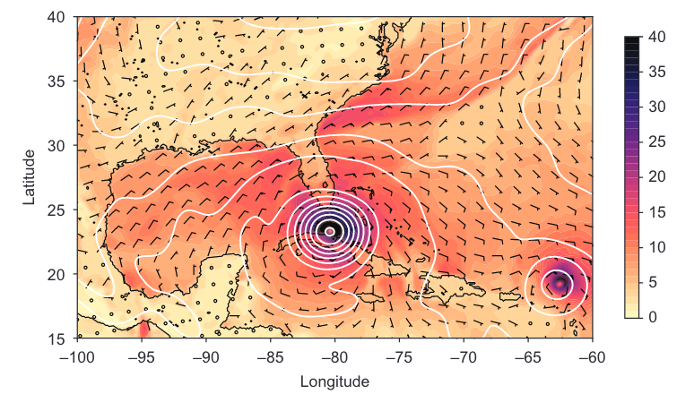

# 第 1 部分 开始学习现代 Fortran

在这一部分，你将品尝一下 Fortran，并初步了解这门语言。在第 1 章中，我们将讨论 Fortran 的设计和特性，以及适合使用 Fortran 的问题类型。你将了解到为什么并行编程很重要，以及何时应该使用它。在第 2 章中，我们将构建一个海啸模拟器的最小工作示例，这个示例将贯穿整本书。这个示例将让你初步了解 Fortran 的基本要素：变量声明、数据类型、数组、循环和分支。如果你是 Fortran 的新手，这是一个很好的开始。在本书的这一部分结束时，你将能够编写简单但实用的 Fortran 程序。更重要的是，你将准备好更深入地学习 Fortran 的基本要素。

# 1. 介绍 Fortran

> **本章内容包括**
> - 什么是 Fortran 以及为什么要学习它？
> - Fortran 的优势和劣势
> - 并行思维
> - 从零开始构建并行模拟应用程序

这是一本关于 Fortran 的书，它是历史上最早的高级编程语言之一。本书将通过逐步引导您开发一个功能齐全的并行物理模拟应用程序来教授您这种语言。请注意重点是并行化。并行编程允许您将问题分解成多个部分，并让多个处理器分别处理问题的一部分，从而在较短的时间内达到解决问题的目的。到最后，您将能够识别可以并行化的问题，并使用现代 Fortran 技术来解决它们。

本书并不是每个 Fortran 特性的全面参考手册，我故意省略了语言的重要部分。相反，我专注于您用于构建实际 Fortran 应用程序的最实用的特性。随着我们逐章开发我们的应用程序，我们将应用现代 Fortran 特性和软件设计技术，使我们的应用程序强大、可移植、易于使用并且易于扩展。这不仅仅是一本关于 Fortran 的书；它是一本关于使用现代 Fortran 构建强大的并行软件的书。 

## 1.1 什么是 Fortran？

> “我不知道 2000 年的编程语言会是什么样子，但我知道它将被称为 Fortran。”
> 
> —— 托尼·霍尔（Tony Hoare），1980 年图灵奖获得者

Fortran 是一种通用的、并行的编程语言，在科学和工程应用中表现出色。最初于 1957 年被称为 FORTRAN（FORmula TRANslation），经过数十年的发展，它已经成为一种稳健、成熟、面向高性能的编程语言。如今，Fortran 在许多我们视为理所当然的系统中仍然发挥作用： 
- 数值天气、海洋和浪涌预测
- 气候科学和预测
- 机械和土木工程中使用的计算流体力学软件
- 用于设计汽车、飞机和航天器的空气动力学求解器
- 机器学习框架使用的快速线性代数库
- 对世界上最快的超级计算机进行基准测试[（https://top500.org）](https://top500.org)

以下是一个具体的例子。在我的工作中，我开发天气、海洋表面波和深海环流的数值模型。多年来，我发现大多数人不知道天气预报来自何处。他们以为气象学家会聚在一起，绘制明天、下周或一个月后天气将会如何的图表。这只是部分正确。实际上，我们使用复杂的数值模型，在仓库大小的计算机上进行大量的数据计算。这些模型模拟大气，以便对未来的天气做出合理的猜测。气象学家使用这些模型的输出来创建有意义的天气地图，就像图 1.1 中所示的那样。这张地图只显示了这个模型产生的所有数据中的一小部分。像这样的天气预报的输出大小以数百千兆字节计算。

最强大的 Fortran 应用程序在数百或数千个 CPU 上并行运行。Fortran 语言及其库的开发在很大程度上是由于解决物理学、工程学和生物医学中极大规模计算问题的需求。为了获得比当时最强大的单台计算机更多的计算能力，在 20 世纪末，我们开始用高带宽网络连接多台计算机，让它们各自处理问题的一部分。结果就是超级计算机，一台由数千个普通 CPU 组成的庞大计算机（图 1.2）。超级计算机类似于由 Google 或 Amazon 托管的现代服务器农场，只是超级计算机的网络基础设施旨在最大化服务器之间的带宽，最小化延迟，而不是与外部世界之间的通信延迟。因此，超级计算机中的 CPU 就像一个由分布式内存访问组成的巨大处理器，其速度几乎与本地内存访问一样快。直到今天，Fortran 仍然是用于这种大规模并行计算的主要语言。

**图 1.1** 2017年9月10日飓风艾尔玛的预报，由用Fortran编写的操作性天气预报模型计算得出。阴影和风羽显示的是米每秒的地表风速，等高线是海平面气压等线。典型的天气预报是使用数百或数千个 CPU 并行计算得出的。（数据由美国国家环境预报中心（NCEP）提供）

**图 1.2** 巴塞罗那超级计算中心的 MareNostrum 4 超级计算机。该计算机位于西班牙加泰罗尼亚巴塞罗那的托雷吉罗纳教堂内。高速网络将所有机柜连接在一起。MareNostrum 4 拥有 153,216 个英特尔至强处理器核心，截至 2020 年 6 月，是西班牙最快的超级计算机，全球排名第 37。（来源：[https://www.top500.org/lists/2020/06](https://www.top500.org/lists/2020/06)）。它被用于许多科学应用领域，从天体物理学和材料物理学，到气候和大气扬尘传输预测，再到生物医学。（图片来源：[https://www.bsc.es/marenostrum/marenostrum](https://www.bsc.es/marenostrum/marenostrum)）

## 1.2 Fortran特性

> 这可不是你父辈的Fortran。 
> 
> —— Damian Rouson

在编程语言的语境下，Fortran具有以下所有特点：
- ***编译型*** --- 你会编写完整的程序并在执行之前将它们传递给编译器。这与解释型编程语言（如Python或JavaScript）形成对比，后者逐行解析和执行代码。尽管这使得编写程序有些繁琐，但它允许编译器生成高效的可执行代码。在典型的使用情况下，Fortran程序的运行速度往往比等价的Python程序快一个或两个数量级。
> **编译器是什么？**
> 编译器是一种计算机程序，它读取用一种编程语言编写的源代码，并将其转换为另一种编程语言中的等价代码。在我们的情况下，一个Fortran编译器将读取Fortran源代码，并生成适当的汇编代码和机器（二进制）指令。
- ***静态类型*** --- 在Fortran中，您将使用类型声明所有变量，并且它们将保持该类型直到程序结束：

您还需要在使用变量之前明确声明它们，这被称为显式类型声明。最后，Fortran采用所谓的强类型，这意味着如果使用错误类型的参数调用过程，编译器将引发错误。虽然静态类型有助于编译器生成高效的程序，显式类型声明和强类型执行良好的编程习惯，使Fortran成为一种安全的语言。我发现编写正确的Fortran程序比Python或Javascript更容易，后者带有许多隐藏的注意事项和“陷阱”。
- ***多范式*** --- 您可以使用几种不同的范式或风格编写Fortran程序：命令式、过程式、面向对象，甚至函数式。根据您要解决的问题，某些范式可能比其他范式更合适。我们将在整本书的编写过程中探讨不同的范式。
- ***并行*** --- Fortran也是一种并行语言。并行性是将计算问题分配给通过网络进行通信的进程的能力。并行进程可以在相同的处理核心上运行（基于线程的并行）、在共享RAM的不同核心上运行（共享内存并行）或分布在网络上（分布式内存并行）。在同一个并行程序上共同工作的计算机可以物理上位于同一个机柜中、彼此之间隔着房间，甚至遍布世界各地。Fortran的主要并行结构是共存数组，它允许您表达并行算法和远程数据交换而无需任何外部库。共存数组允许您像访问数组元素一样访问远程内存，如下列表所示:

Fortran标准并不规定数据交换在底层是如何实现的；它仅仅规定语法和期望的行为。这使得编译器开发人员可以在任何特定硬件上使用最佳方法。有了一款功能强大的编译器和库，Fortran程序员可以编写能在传统CPU或通用GPU上运行的代码。列表1.1仅供说明；然而，如果您想编译并运行它，请在按照附录A中的说明设置您的Fortran开发环境之后再这样做。
- ***成熟*** --- 2016年，我们庆祝Fortran诞生60周年。这门语言经历了几个标准的修订：  
  – FORTRAN 66，也称为FORTRAN IV（ANSI，1966年）  
  – FORTRAN 77（ANSI，1978年）  
  – Fortran 90（ISO/IEC，1991年；ANSI，1992年）  
  – Fortran 95（ISO/IEC，1997年）  
  – Fortran 2003（ISO/IEC，2004年）  
  – Fortran 2008（ISO/IEC，2010年）  
  – Fortran 2018（ISO/IEC，2018年）  
Fortran在编译器的开发和实现方面得到了工业界的大力支持：IBM、Cray、Intel、NAG、NVIDIA等等。还有相当多的开源开发，其中最著名的是自由编译器gfortran[(https://gcc.gnu.org/wiki/GFortran）](https://gcc.gnu.org/wiki/GFortran)、Flang[https://github.com/flangcompiler/flang）](https://github.com/flangcompiler/flang)（和LFortran[（https://lfortran.org）](https://lfortran.org)，以及其他社区项目[（https://fortran-lang.org/community）](https://fortran-lang.org/community)。由于Fortran在计算机科学的早期占据主导地位，今天我们拥有了庞大而成熟的库，这些库是许多应用程序的计算基础。凭借成熟的编译器和庞大的遗留代码库，Fortran仍然是许多新软件项目的首选语言，特别是对于那些计算效率和并行执行至关重要的项目。
- ***易于学习*** --- 信不信由你，Fortran 实际上相当容易学习。这是我和许多同事的经验。Fortran易学部分归功于其严格的类型系统，这使得编译器能够在编译时检查程序员并在他们犯错时发出警告。虽然冗长，但语法清晰易读。然而，就像其他编程语言或一般技能一样，掌握Fortran是困难的。这也是我选择写这本书的原因之一。