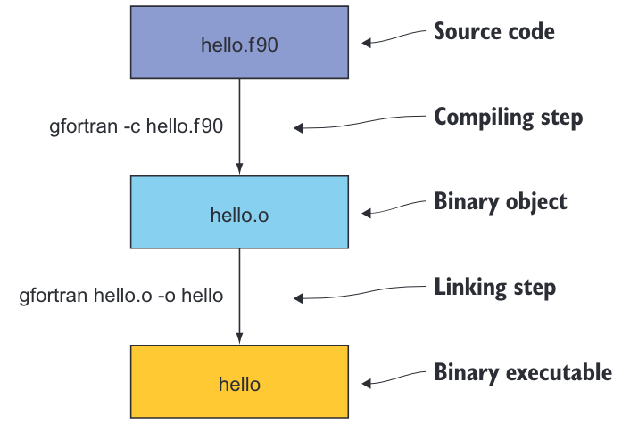
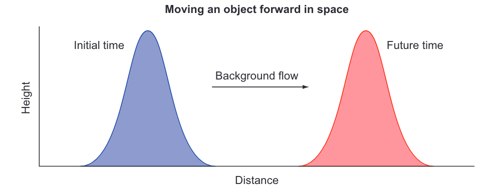

# 第2章 入门：最小可行应用

> ***本章涵盖***
> 编译和运行你的第一个Fortran程序 
> 数据类型、声明、算术和控制流 
> 构建和运行你的第一个模拟应用

在本章中，我们将实现海啸模拟器的最小可行版本。为简单起见，我们将从模拟水在空间中的移动开始，而不改变其形状。这个问题足够复杂，可以介绍Fortran的基本要素：数值数据类型、声明、算术表达式和赋值，以及控制流。一旦我们成功地在本章中模拟了对象的移动，我们将重构代码，在第3章和第4章中添加其他物理过程，从而使模拟的水流动更加真实。实现其他过程将更容易，因为我们将能够重用在本章中编写的大部分代码。

我们将从编译、链接和运行你的第一个Fortran程序开始。然后，我将介绍我们想要解决的物理问题，并向你展示如何将其表达为计算机程序的形式。接着，我们将深入探讨Fortran的基本要素：数据类型、声明、算术和控制流。在本章结束时，你将具备编写基本但实用的Fortran程序的工作知识。

## 2.1 编译和运行你的第一个程序

让我们首先创建、编译和运行你的第一个Fortran程序。我假设你已经在系统上安装了GNU Fortran编译器（gfortran）。如果还没有安装，请按照附录A中的说明进行设置。

当你安装了编译器后，请通过编译和运行你的第一个Fortran程序来测试它，如下面的示例所示。

> **程序2.1**  您的第一个Fortran程序：hello.f90

```fortran
! 开始程序并为其命名
program hello
    ! 向终端打印简短的问候语
    print *, 'Hello world!'
! 结束程序
end program hello
```

这个程序只做一件事情——向终端打印一条简短的问候信息，这是大多数编程书籍中第一个示例的常见做法。让我们将其保存在名为 hello.f90 的文件中。编译非常简单，只需将源文件传递给编译器，可选地指定输出（-o）可执行文件的名称：
```bash
gfortran hello.f90 -o hello
```
如果您不使用 -o 指定输出文件的名称，则可执行文件的名称默认为 a.out。

运行程序会产生预期的输出：

```bash
./hello             # 通过输入可执行文件名运行程序
    Hello world!    # 程序在终端中的输出
```

这就是全部——你编写并编译了你的第一个Fortran程序！让我们看看在幕后发生了什么。构建程序通常涉及两个步骤：
1 *编译* — 编译器解析高级语言（这里是Fortran）的源代码，并输出相应的一组机器指令。在我们的情况下，gfortran将读取带有 .f90 后缀的Fortran源文件，并输出一个相应的二进制对象文件，其后缀为 .o。大多数编译器都接受其他源文件的后缀，如 .f、.f03 或 .f08；然而，为了保持一致性，我建议坚持使用 .f90。
2 *链接* — 二进制对象文件（.o），是编译步骤的结果，本身无法执行。链接器通常由编译器在幕后调用，将二进制对象文件组合成一个或多个可执行程序。

要构建我们的第一个程序，我们只需输入一个命令，即 `gfortran hello.f90 -o hello`，这意味着没有将编译和链接分为两个独立的步骤。当整个程序包含在一个单独的文件中时，将编译和链接步骤组合在一个命令中就足够了。该命令等同于以下程序。

> **程序2.2** 编译和链接作为单独的步骤 
```bash
gfortran -c hello.f90       # 仅编译，无链接 
gfortran hello.o -o hello   # 链接对象到可执行文件
```

在这段代码中，编译器选项 `-c` 表示 *仅编译，不链接* 。这个过程在我们需要在链接成一个程序之前编译多个源文件时是必要的。随着你的应用程序或库的规模增大，你会发现将其分割成多个文件会更容易组织和进一步开发。我在图 2.1 中说明了构建顺序。


> **图 2.1** 显示了将输入的源代码生成二进制目标文件和可执行文件的编译和链接步骤。源文件 hello.f90 被传递给编译器，编译器输出一个二进制目标文件 hello.o。然后将目标文件传递给链接器，链接器输出一个二进制可执行文件 hello。链接器被隐含地包含在编译器命令（`gfortran`）中。

GNU Fortran编译器可以接受许多其他选项，用于控制语言规则、警告消息、优化和调试。我鼓励你继续阅读手册。你可以在命令行上键入 man gfortran 来访问它。如果你的系统上没有手册页面，你可以随时在 <https://gcc.gnu.org/onlinedocs/gfortran> 上访问最新的 gfortran 文档。

## 2.2 模拟物体运动

在上一章的最后，我介绍了浅水方程组，我们将在本书中努力解决这些方程，以产生一个逼真的海啸模拟。在这里，我们将从头开始实现模拟器，包括源代码和我们将用它模拟的物理过程。我们将首先模拟的过程是物体运动，因为背景流动而引起的。在物理学中，我们将这种运动称为线性对流。对流意味着在空间中移动，而线性属性意味着背景流与物体的形状和位置无关。如果你不是数学或物理方面的专家，这听起来可能有些吓人，但不用担心！在接下来的小节中，我将说明对流的工作原理，并展示你如何计算它，而不必理解其背后的所有数学原理。

> **从微积分到代码**
> 
> 如果你想深入了解这个问题背后的数学知识，请前往附录 B。在那里，我解释了梯度，这是对流背后的关键概念，以及如何使用有限差分在计算机代码中表达它。这一步是重要的，因为它构成了表达浅水方程中所有其他项的基础。否则，如果你想跳过数学部分，直接进入编程部分，那就继续吧！

在下一小节中，我将阐述问题并为我们的应用程序设定一些要求。然后，我将通过一个说明性的对流示例来指导你，展示如何在不编写任何代码的情况下计算它。最后，在本章的其余部分，我们将一起着手实现我们应用程序的第一个版本。

### 2.2.1 我们的应用程序应该做什么？

在这个阶段，我们只会模拟物体（或流体）由于背景流而产生的运动。这将为我们在后续章节中将要添加到求解器中的其他物理过程提供基础。现在只模拟一个过程将指导我们的程序结构及其组成部分的设计：数据的声明和初始化，按时间向前迭代模拟，并将结果写入终端。我在图 2.2 中勾勒了我们期望的结果。


> **图 2.2** 在空间中对物体进行对流运动，从左到右。初始状态在左侧。物体被背景流从左到右对流，经过一段时间后到达最终位置在右侧。

请注意，被对流的物体可以是任何量，例如水位、温度或污染物的浓度。就目前而言，为简单起见，我们将其简称为物体。物体的形状也是任意的，可以是任何连续或不连续的函数。我选择了一个平滑的凸起方便起见。在初始时间，物体位于域的左侧附近。我们的目标是模拟由于背景流而导致的物体运动，并记录物体在未来某个时间的状态。在内部，我们的应用程序需要执行以下步骤：

1. *初始化* ——— 定义将在计算机内存中保存物体状态的数据结构，并初始化其值。
2. *模拟* ——— 此步骤将计算物体位置随时间的变化。在此阶段，我们预计它只会从左向右移动，形状不变。模拟在许多离散时间步骤上进行，并占据程序消耗的大部分计算时间。
3. *输出* ——— 在每个时间步骤中，我们将记录物体的状态，以便我们可以用外部程序可视化它。
 
正如您所料，我们程序的核心将围绕模拟步骤展开。我们如何开始模拟物体的移动？在编写任何代码之前，我们需要了解对流的工作原理。