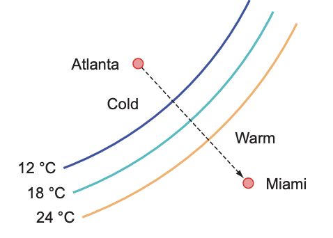
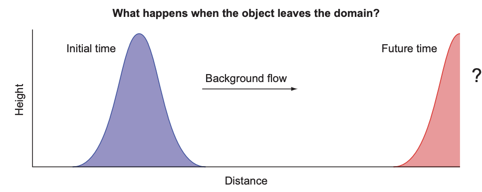

# 第2章 入门：最小可行应用

> ***本章涵盖***
> 
> 编译和运行你的第一个Fortran程序 
> 数据类型、声明、算术和控制流 
> 构建和运行你的第一个模拟应用

在本章中，我们将实现海啸模拟器的最小可行版本。为简单起见，我们将从模拟水在空间中的移动开始，而不改变其形状。这个问题足够复杂，可以介绍Fortran的基本要素：数值数据类型、声明、算术表达式和赋值，以及控制流。一旦我们成功地在本章中模拟了对象的移动，我们将重构代码，在第3章和第4章中添加其他物理过程，从而使模拟的水流动更加真实。实现其他过程将更容易，因为我们将能够重用在本章中编写的大部分代码。

我们将从编译、链接和运行你的第一个Fortran程序开始。然后，我将介绍我们想要解决的物理问题，并向你展示如何将其表达为计算机程序的形式。接着，我们将深入探讨Fortran的基本要素：数据类型、声明、算术和控制流。在本章结束时，你将具备编写基本但实用的Fortran程序的工作知识。

## 2.1 编译和运行你的第一个程序

让我们首先创建、编译和运行你的第一个Fortran程序。我假设你已经在系统上安装了GNU Fortran编译器（gfortran）。如果还没有安装，请按照附录A中的说明进行设置。

当你安装了编译器后，请通过编译和运行你的第一个Fortran程序来测试它，如下面的示例所示。

> **程序2.1**  您的第一个Fortran程序：hello.f90

```fortran
! 开始程序并为其命名
program hello
    ! 向终端打印简短的问候语
    print *, 'Hello world!'
! 结束程序
end program hello
```

这个程序只做一件事情——向终端打印一条简短的问候信息，这是大多数编程书籍中第一个示例的常见做法。让我们将其保存在名为 hello.f90 的文件中。编译非常简单，只需将源文件传递给编译器，可选地指定输出（-o）可执行文件的名称：
```bash
gfortran hello.f90 -o hello
```
如果您不使用 -o 指定输出文件的名称，则可执行文件的名称默认为 a.out。

运行程序会产生预期的输出：

```bash
./hello             # 通过输入可执行文件名运行程序
    Hello world!    # 程序在终端中的输出
```

这就是全部——你编写并编译了你的第一个Fortran程序！让我们看看在幕后发生了什么。构建程序通常涉及两个步骤：
1 *编译* — 编译器解析高级语言（这里是Fortran）的源代码，并输出相应的一组机器指令。在我们的情况下，gfortran将读取带有 .f90 后缀的Fortran源文件，并输出一个相应的二进制对象文件，其后缀为 .o。大多数编译器都接受其他源文件的后缀，如 .f、.f03 或 .f08；然而，为了保持一致性，我建议坚持使用 .f90。
2 *链接* — 二进制对象文件（.o），是编译步骤的结果，本身无法执行。链接器通常由编译器在幕后调用，将二进制对象文件组合成一个或多个可执行程序。

要构建我们的第一个程序，我们只需输入一个命令，即 `gfortran hello.f90 -o hello`，这意味着没有将编译和链接分为两个独立的步骤。当整个程序包含在一个单独的文件中时，将编译和链接步骤组合在一个命令中就足够了。该命令等同于以下程序。

> **程序2.2** 编译和链接作为单独的步骤 
```bash
gfortran -c hello.f90       # 仅编译，无链接 
gfortran hello.o -o hello   # 链接对象到可执行文件
```

在这段代码中，编译器选项 `-c` 表示 *仅编译，不链接* 。这个过程在我们需要在链接成一个程序之前编译多个源文件时是必要的。随着你的应用程序或库的规模增大，你会发现将其分割成多个文件会更容易组织和进一步开发。我在图 2.1 中说明了构建顺序。


> **图 2.1** 显示了将输入的源代码生成二进制目标文件和可执行文件的编译和链接步骤。源文件 hello.f90 被传递给编译器，编译器输出一个二进制目标文件 hello.o。然后将目标文件传递给链接器，链接器输出一个二进制可执行文件 hello。链接器被隐含地包含在编译器命令（`gfortran`）中。

GNU Fortran编译器可以接受许多其他选项，用于控制语言规则、警告消息、优化和调试。我鼓励你继续阅读手册。你可以在命令行上键入 man gfortran 来访问它。如果你的系统上没有手册页面，你可以随时在 <https://gcc.gnu.org/onlinedocs/gfortran> 上访问最新的 gfortran 文档。

## 2.2 模拟物体运动

在上一章的最后，我介绍了浅水方程组，我们将在本书中努力解决这些方程，以产生一个逼真的海啸模拟。在这里，我们将从头开始实现模拟器，包括源代码和我们将用它模拟的物理过程。我们将首先模拟的过程是物体运动，因为背景流动而引起的。在物理学中，我们将这种运动称为线性对流。对流意味着在空间中移动，而线性属性意味着背景流与物体的形状和位置无关。如果你不是数学或物理方面的专家，这听起来可能有些吓人，但不用担心！在接下来的小节中，我将说明对流的工作原理，并展示你如何计算它，而不必理解其背后的所有数学原理。

> **从微积分到代码**
> 
> 如果你想深入了解这个问题背后的数学知识，请前往附录 B。在那里，我解释了梯度，这是对流背后的关键概念，以及如何使用有限差分在计算机代码中表达它。这一步是重要的，因为它构成了表达浅水方程中所有其他项的基础。否则，如果你想跳过数学部分，直接进入编程部分，那就继续吧！

在下一小节中，我将阐述问题并为我们的应用程序设定一些要求。然后，我将通过一个说明性的对流示例来指导你，展示如何在不编写任何代码的情况下计算它。最后，在本章的其余部分，我们将一起着手实现我们应用程序的第一个版本。

### 2.2.1 我们的应用程序应该做什么？

在这个阶段，我们只会模拟物体（或流体）由于背景流而产生的运动。这将为我们在后续章节中将要添加到求解器中的其他物理过程提供基础。现在只模拟一个过程将指导我们的程序结构及其组成部分的设计：数据的声明和初始化，按时间向前迭代模拟，并将结果写入终端。我在图 2.2 中勾勒了我们期望的结果。


> **图 2.2** 在空间中对物体进行对流运动，从左到右。初始状态在左侧。物体被背景流从左到右对流，经过一段时间后到达最终位置在右侧。

请注意，被对流的物体可以是任何量，例如水位、温度或污染物的浓度。就目前而言，为简单起见，我们将其简称为物体。物体的形状也是任意的，可以是任何连续或不连续的函数。我选择了一个平滑的凸起方便起见。在初始时间，物体位于域的左侧附近。我们的目标是模拟由于背景流而导致的物体运动，并记录物体在未来某个时间的状态。在内部，我们的应用程序需要执行以下步骤：

1. *初始化* ——— 定义将在计算机内存中保存物体状态的数据结构，并初始化其值。
2. *模拟* ——— 此步骤将计算物体位置随时间的变化。在此阶段，我们预计它只会从左向右移动，形状不变。模拟在许多离散时间步骤上进行，并占据程序消耗的大部分计算时间。
3. *输出* ——— 在每个时间步骤中，我们将记录物体的状态，以便我们可以用外部程序可视化它。
 
正如您所料，我们程序的核心将围绕模拟步骤展开。我们如何开始模拟物体的移动？在编写任何代码之前，我们需要了解对流的工作原理。

### 2.2.2  什么是对流？

维基百科将对流定义为“物质或量通过整体运动的传输。” 对流是物理学、工程学和地球科学中的基本过程。它决定了固体物体或流体由于背景流而在空间中移动的方式。当游泳者顺流而泳时，他们被流水带动，与地面的速度相对较低，而如果没有任何流动，他们的速度会更快。对流也是我们在加勒比海、巴西或北欧上空发现撒哈拉沙尘的原因，也是垃圾在海洋盆地中汇聚的原因。

我之前提到，在本章中我们只讨论线性对流。这里的线性意味着可以假设背景流是恒定的，并且不会因为与被对流的物体本身的相互作用而改变。如图2.2所示，物体以与物体本身无关的恒定速度移动。换句话说，物体的形状和位置不会影响背景流。然而，在现实世界中，这几乎从来没有发生过！速度的非线性对流是产生湍流的原因。小涡流在河流中，商业飞行中偶尔的颠簸，以及我们在木星大气的照片中看到的大理石纹理，都是由于不同空间尺度上的非线性对流造成的湍流的例子。我们将把非线性对流留到第4章；在这里，我们只关注线性部分。

为了更好地理解对流的工作原理，考虑一下冷锋穿过美国东南部的情况（图2.3）。冷锋是与中纬度气旋相关的大尺度天气现象。它通常在北半球从西北向东南移动（在南半球从西南向东北移动），并带来凉爽而干燥的空气。我住在南佛罗里达州，冷锋的来临总是引人期待，因为它们带来了来自北方的清爽凉爽的空气。


> **图 2.3** 展示了一张冷锋从亚特兰大向迈阿密移动的插图。曲线表示恒定温度的等值线。虚线箭头显示了前方传播的方向。

现在我给你一个小练习。考虑以下情况：
- 亚特兰大的温度为 12°C，迈阿密的温度为 24°C。
- 亚特兰大和迈阿密之间的距离为 960 公里。
- 冷锋以每小时 20 公里的恒定速度向迈阿密移动。

假设没有其他影响因素，温度变化在空间上是均匀的：
1. 亚特兰大和迈阿密之间的温度梯度是多少？梯度是两个位置之间数量（在这里是温度）的差异，除以它们之间的距离。在这种情况下，温度梯度的单位是°C/公里。
2. 温度在多长时间内会降至 12°C？
3. 最后，经过 24 小时，迈阿密的温度将是多少？你是如何得出这个结果的？

尝试用纸和笔解决这个问题。当你完成练习后，即使你没有意识到，你也已经解决了线性平流方程。平流方程预测了任何数量由于该数量的空间梯度和背景流的变化而发生的变化。我们将使用完全相同的计算方法来预测模拟器中对象的运动。你可以在本章末尾的“答案”部分找到这个练习的答案。

## 2.3 实现最小工作应用

设置要解决的问题后，我们很快就能开始深入研究 Fortran 编程。但首先，我们将在下一小节中讨论实施策略（你应该总是有一个）。然后，我们将介绍语言的核心要素，并将它们应用于实现海啸模拟器的第一个版本。

### 2.3.1 实施策略

在进行任何编码之前，草拟我们实现第一个应用程序版本的初步策略将是有帮助的：

1. 定义主程序。这将定义程序名称和范围。主程序单元提供了一个骨架来保存数据的声明和可执行代码，比如算术、循环等等。
2. 声明和初始化变量和常量。我们需要声明我们程序中打算使用的所有变量和常量：
   - 整数计数器 `i` 和 `n`，分别用于空间和时间，以及相应的循环维度 `grid_size` 和 `num_time_steps`。空间维度大小 `size`，`grid_size` 将确定数组的长度，而时间维度大小 `num_time_steps` 将确定我们将计算解的迭代次数。
   - 背景流速度 `c`、时间步长 `dt` 和网格间距 `dx` 的物理常数。
   - 用于水位 `h` 及其有限差分 `dh` 的实值数组，使得对于每个 `i`，`dh(i) = h(i) - h(i-1)`。数组 `dh` 对于在内存中保留多个时间级别计算解是必要的。
3. 计算一组固定数量时间步的方程解。这一步包括三个明确的部分：
   - 循环一组固定数量的时间步（`num_time_steps`）。
   - 在每一步，根据上一时间步的值计算水位 `h` 的新值。
   - 因为我们的域的大小是有限的（`grid_size`），我们需要定义边界条件。当对象到达域的最右边缘时会发生什么情况（见图 2.4）？
  
    在这里我们有几个选择。对象可能被边界吸收，完全离开域而不留痕迹，或者被反射回域内，就像球撞到墙壁一样。另一个选择是周期性（或循环）边界条件，它连接了域的右边缘和左边缘。在这种情况下，对象会通过右边并重新出现在左边。这是全球大气和海洋预测中的常见选择，因为我们的星球在计算域中的表示方式。如果你往东走足够远，你最终会到西边！因此，我们将在我们的应用程序中实现周期性边界条件。
4. 在每一步将解输出到终端。起初，我们不需要复杂或特别格式化的输出。让我们只是将我们的解以默认文本格式输出到屏幕上。如果我们想要将输出存储在文件中以进行分析或绘图，我们可以轻松地将输出重定向到文件中。
   
听起来不错吧？让我们逐一解决这些问题。


> **图 2.4** 边界条件决定了当对象到达域的边缘时会发生什么。它应该只是离开吗？像球撞到墙壁反射回域内？或者循环并重新出现在左侧？

### 2.3.2 定义主程序

主程序是Fortran中的基本程序单元。它允许您为程序指定一个名称，并定义程序的范围，如下面的代码所示。

> **程序2.3** 定义程序单元和范围
```fortran
program tsunami         ! 开始新程序并为其命名
end program tsunami     ! 结束程序
```

给程序指定一个名称在实践中并没有实际作用，但当您开始使用数十个不同的程序时，它可以帮助您保持组织性。

编译和链接主程序源文件会生成一个可执行文件，您可以从主机操作系统中调用它（参见图 2.1）。您无法从其他程序单元调用主程序。

> **还有哪些程序单元？** 
> 
> 在这里，我为您提供了第 3 章和第 4 章即将介绍的内容的一瞥。不同的程序单元可以一起形成一个可执行程序或一个不可执行的库：
> - *主程序(Main program)* —— 顶层单元，只能从操作系统中调用
> - *函数(Function)* —— 从表达式中调用的可执行子程序，始终返回单个结果
> - *子程序(Soubroutine)* —— 可执行子程序，可以原地修改多个参数，但不能用于表达式中
> - *模块(Modue)* —— 变量、函数和子程序定义的非可执行集合
> - *子模块(Submodule)* —— 扩展现有模块，用于定义仅该模块可以访问的变量和过程定义；对于更复杂的应用程序和库非常有用
> 
> 目前，我们只能使用主程序。我们将在第 3 章深入研究函数和子程序，而在第 4 章中则是模块。

程序语句不是强制性的。对于简短的测试程序，省略它可能很有用。但是，最好的做法是包含它，并与相应的`end program`语句配对。从技术上讲，`end`是任何Fortran程序唯一必需的语句。该语句也构成了最简单的、虽然无用的Fortran程序。

> **提示**：始终将程序语句与相应的`end program`语句配对。

### 2.3.3 声明和初始化变量

> 显式胜于隐式。
> —— Tim Peters

程序单元的第一部分是声明部分。Fortran 使用静态、显式、强类型系统：
- **静态** — 每个变量在编译时都有一个数据类型，并且该类型在程序的整个生命周期内保持不变。
- **显式** — 在使用之前，所有变量都必须在声明部分中明确声明。隐式声明是一个例外和警告，会在边栏中描述。
- **强类型** — 当变量在程序和函数或子程序之间传递时，变量必须是类型兼容的。

> **隐式类型声明**
>
> Fortran 具有一项历史特性，称为隐式类型声明，它允许编译器根据变量的首字母推断变量类型。是的，你没看错。隐式类型声明来自 Fortran（咳咳，FORTRAN）早期（即类型声明被引入语言之前）的时期。任何以 I、J、K、L、M 或 N 开头的变量都是整数，否则是实数（浮点数）。FORTRAN 66 引入了数据类型，而 FORTRAN 77 引入了 `IMPLICIT` 语句以覆盖默认的隐式类型声明规则。直到 Fortran 90，该语言才允许通过在声明之前使用 `implicit none` 语句完全禁用隐式类型声明行为。
> 
> `implicit none` 语句将指示编译器在尝试使用未声明的变量时报告错误。始终使用 `implicit none`！

内置类型由语言标准定义，并可立即供使用。Fortran 有三种数值类型：
- `integer`：整数，例如 `42` 或 `-17`
- `real`：浮点数，例如 `3.141` 或 `1.82e4`
- `complex`：一对数值：一个是复数的实部，另一个是虚部；例如 `(0.12, -1.33)`

数值类型还有不同的种类。Fortran 种类指的是为变量保留的内存大小。它决定了可允许的数值范围，在实数和复数的情况下，还决定了精度。一般来说，更高的整数种类允许更广泛的数值范围。更高的实数和复数种类会产生更高的允许范围和更高的数值精度。您将在第 4 章中更多地了解数值类型种类。

除了数字内置类型外，Fortran 还有逻辑类型 `logical` 用于表示布尔（`true`或`false`）状态，以及字符类型 `character` 用于文本数据。这五种内置类型（`integer`、`real`、`complex`、`logical` 和 `character`）是 Fortran 程序中所有变量的基础。您还可以使用它们创建任何复杂度的复合类型，称为派生类型，类似于 C 中的 `struct` 和 Python 中的 `class`。我们将在第 8 章深入探讨派生类型。

> **提示**：始终使用 `implicit none`。该语句强制对所有变量进行显式声明，这既作为程序员的文档，也允许编译器为您查找并报告类型错误。

### 2.3.4 数值数据类型
Fortran 提供了三种基本的数值数据类型：整数（`integer`）、实数（`real`）和复数（`complex`）。

整数（INTEGER）
整数是 Fortran 中最简单的数值类型。以下是整数字面量的一些示例：
```fortran
0 1 42 100 -500 +1234567
```
您可以像这样声明一个或多个整数：
```fortran
integer :: i, n
```
该语句指示编译器在内存中为整数变量 `i` 和`n` 保留空间。它由左侧的类型语句（`integer`）、中间的双冒号（`::`）以及用逗号分隔的变量列表组成。

整数的一般规则：
- 整数始终有符号 —— 它们可以是负数、正数或零。
- 它们的范围受其类型种类的限制。较大的类型种类会产生更广泛的范围。
- 超出变量允许范围的结果是溢出。在这种情况下，变量的值将围绕其范围限制进行循环。
- 默认情况下，内存中的整数大小未由 Fortran 标准定义，因此是与系统相关的。但是，在大多数系统上，默认的整数大小为 4 个字节。

实数（REAL）
实数，也称为浮点数，描述了沿着连续（非离散）轴具有值的任何数字。以下是一些实数的示例：
```fortran
0.0 1.000 42. 3.14159256 -5e2 +1.234567e5
```
前四个数值很直观 —— 小数点将数字的整数部分与小数部分分隔开。最后两个可能看起来有些奇怪，因为它们是使用指数表示法写成的。它们由字符 `e` 的左侧是整数或实数，右侧是表示十进制指数的整数组成。因此，`-5e2` 对应于 $-5 × 10^2$，`+1.234567e5` 对应于 $1.234567 × 10^5$。对于正数，一元加号符号是可选的。我们将在第 6 章中更多地讨论实数的格式。

> **要注意小数点**！
> 
> 在编写字面常量时，存在一个细微的界限，决定了编译器将其理解为整数还是实数。在数字后面加一个小数点就会产生区别。例如，`42` 是一个整数，但 `42.` 是一个实数。这与 C 或 Python 的行为相同。

我们使用关键字 real 来声明实数：
```fortran
real :: x
```
这个声明语句类似于整数的声明语句，只是类型和变量名不同。
复数
复数简单地说就是一对实数，一个用于实部，另一个用于虚部。它们的声明和初始化如下：
```fortran
complex :: c = (1.1, 0.8)
```
复数的内置类型被引入到Fortran中，使得复数的算术运算更容易编程。根据你的应用，你可能会经常使用它们，也可能根本不使用。

### 2.3.5 在我们的应用程序中声明要使用的数据
现在，您已经了解了如何声明特定数字类型的变量，让我们声明一些在海啸模拟器中将要使用的变量、常量和数组。
声明变量
我们需要哪些类型的变量？作为提醒，根据我们在第2.3.1节中的实现策略，我们需要以下内容：

- 空间数组大小，`grid_size` 和时间步数，`num_time_steps`
- 物理常数，如时间步长 `dt`、网格大小 `dx` 和背景流速度 `c`
- 一维数组以携带水位 `h` 的值及其在空间中的差异 `dh`
- 一个整数索引 `i`，用于引用单个数组元素 `h(i)`，另一个用于在时间上进行循环 `n`

由于我们需要先指定 `grid_size`，然后才能声明数组 `h`，所以让我们先声明标量变量和常量，然后再声明数组，如下面的清单所示。