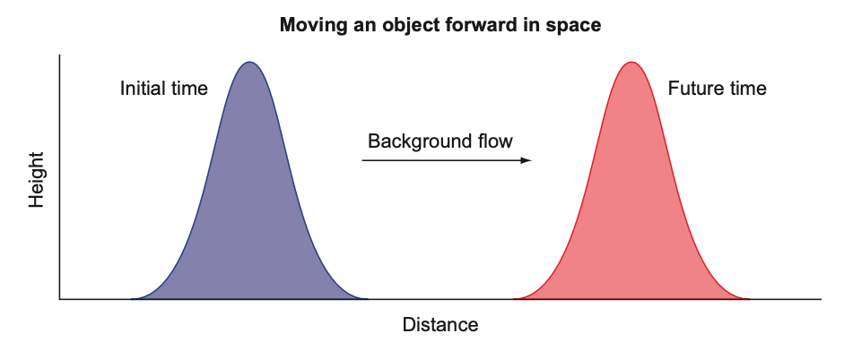
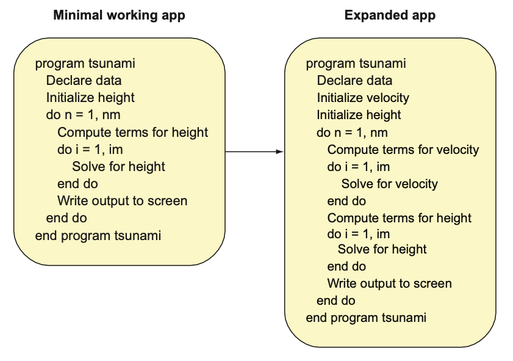
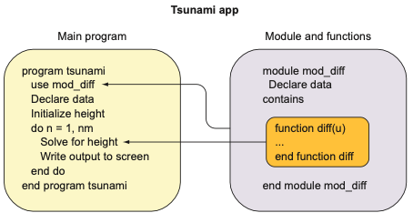
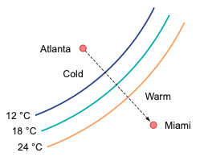

# 第二部分 Fortran的核心要素

本部分涵盖了Fortran的核心要素：过程、模块、数组和I/O。

在第3章中，您将学习有关函数和子程序（统称为过程）的最重要的知识。它们将使您能够抽象出需要多次运行的任何代码片段。函数和子程序是基本构建模块，使您能够编写可重用、可组合且复杂（但不复杂）的代码。您将应用这些知识来重构我们在第2章中开始的海啸模拟器。

在第4章中，您将了解模块以及如何使用它们来组织您的数据和过程，形成可重用和可移植的组件。

第5章涵盖了数组，这是Fortran的基本数据结构。您将学习如何声明、初始化和使用数组，以及如何利用整个数组算术来极大简化您的代码。您将使用数组分析股价时间序列。

最后，第6章涵盖了I/O。您将学习如何从标准输入、输出和错误流中读取和写入数据，以及如何从磁盘文件中读取和写入数据。您还将学习如何将数字数据格式化为文本。您将通过为命令行编写一个最小的笔记应用程序来练习这些技能。

通过学习本书的这一部分，并进行一些练习，您将成为一个功能齐全且独立的Fortran程序员。您将能够从头开始编写Fortran程序和库来解决现实世界的问题。

## 第3章 使用函数和子程序编写可重用代码

> **本章涵盖了以下内容**：
> - 过程是什么以及为什么我们使用它们
> - 过程分为两种类型：函数和子程序
> - 编写不引起副作用的过程
> - 编写适用于标量和数组的过程

在上一章中，您学习了Fortran的核心要素：标量和数组变量的声明、使用do循环迭代代码部分指定次数以及算术表达式和赋值。我们利用这些要素编写了一个简单的模拟器，用于预测由背景流引起的物体在空间和时间中的运动。随着我们学习新的Fortran特性，我们将不断扩展和改进我们的应用程序，以生成更真实的模拟结果。本章介绍了函数和子程序，它们将帮助我们管理日益复杂的应用程序。

本章主要介绍了如何在保持简单性的同时扩展不断增长的应用程序。到目前为止，我们的最小工作应用程序是作为一个单一程序组织的，其中包含一些语句，程序依次执行。这是命令式编程的方式 - 您告诉计算机要做什么，一条语句接一条语句。这种方法之所以有效，是因为我们处理的问题相对简单。然而，现在我们将为更现实的流体动力学模拟做准备，这将需要更多的移动部件和复杂性。

这就是函数和子程序的用武之地。它们允许我们定义自包含且可重用的代码片段，我们可以在需要时调用它们，并使用不同的输入数据。过程是我们将在本书中一遍又一遍重复使用的基本构建模块。

## 3.1 迈向更高的应用程序复杂性

> 简单胜于复杂，复杂胜于混乱。
> 
> — Tim Peters，《Python之禅》

尽管这是Python的口头禅，但这句开场白同样适用于Fortran和一般编程。我们总是尽量保持简单。这在软件设计中尤为重要，因为我们经常处理越来越复杂的系统。简单易于阅读、理解，并且向我们的朋友和同事解释。然而，随着我们构建应用程序、库或框架，保持简单却是一项挑战。我们添加的功能越多，处理的特殊情况越多，我们的应用程序看起来就越臃肿，我们担心项目会失控。它不可避免地变得更加复杂。这是否意味着它必须变得更加复杂？

我没有传统的计算机科学背景。我最初学习编程是为了解决物理问题，就像我们在上一章中所做的那样。对我来说，编程更多地是一种解决给定任务的工具，而不是一种艺术。我的一些程序很容易就能增长到几千行代码，包含难以理解的读写二进制文件、嵌套循环和无尽的命令式表达式和赋值。没有函数调用，没有代码重用。用面向对象的类和方法抽象数据？别想了！这简直是程序员的噩梦。

随着时间的推移，我了解到Fortran专门设计的功能，使编程变得更容易。例如，您可以将重复的计算写成函数，并用不同的输入多次调用它。您可以使用Fortran 90标准引入的模块来定义变量和过程，然后可以从程序或库的其他位置访问它们。仔细组合这些元素，无论您更喜欢面向对象、函数式还是纯过程式的编程方法，都会让您的生活更轻松。

### 3.1.1 重构海啸模拟器

在上一章中，我们制作了一个初步可行的水波模拟器的第一个工作版本。它包含在一个单独的程序中，包括数据声明和初始化、算术表达式和赋值来计算解决方案、一个do循环来推进解决方案在时间上向前移动，以及一个打印语句来在每个时间步骤将结果输出到屏幕上。这是一个简单的程序，有26行代码，只做简单的事情：初始化水高度，模拟由于背景流动而向前移动的过程，并在每个时间步骤将其状态写入屏幕上（图3.1）。



> **图3.1** 将一个高斯形状从左向右移动的过程。我们在上一章中解决了这个问题。

在本章中，我们将重构模拟器，使用一组常见的构建块，例如我在第2章介绍的有限差分计算。这将使我们能够更轻松地在接下来的章节中扩展模拟器，以便更接近更真实的水波运动。回顾我们前一章中解算器的核心，如下清单所示。

> **程序3.1** 最小工作海啸模拟器中的时间积分循环

```fortran
! 针对 num_time_steps 时间步进行迭代   
time_loop: do n = 1, num_time_steps  
    
    dh(1) = h(1) - h(grid_size)  ! 计算左边界的差异

    ! 计算其余区域的差异
    do concurrent (i = 2:grid_size)
      dh(i) = h(i) - h(i-1)  
    end do

    ! 计算并存储下一个时间步的h值
    do concurrent (i = 1:grid_size)
      h(i) = h(i) - c * dh(i) / dx * dt  
    end do
end do time_loop
```

主循环（time_loop）的主体包括两个步骤：计算空间中水高度h的差异，并使用该差异来预测和存储其在下一个时间步的新值。这只解决了水高度的一个方程，其中包含一个物理项，即线性平流。

为了添加更多的术语和另一个方程，我们将为水速度定义一个新数组u，并在time_loop内部添加任何计算，使求解器完整。在不假设方程式或代码应该是什么样子的情况下，图3.2说明了我们应用程序的暂定更新。



> **图 3.2** 将最小工作应用程序扩展为更实际的模拟器

我们用来模拟水位演变的关键操作——初始化、计算时间变化和求解方程——现在都需要针对水位和速度进行。如果我们添加了用于解算另一个变量的代码，那么我们的程序大小至少会翻倍。此外，如果我们为每个方程添加了更多的项，我们的程序将进一步增长。很明显，如果我们不断地在程序堆叠更多的代码，那么我们的程序将变得难以处理。

在前一章中，您了解到流体动力学中的大部分计算工作归结为用离散形式逼近偏导数，并将其表达为代码。有限差分，我们用它来计算水面梯度以预测由于平流而导致的运动，将用于海啸模拟器中的所有其他项。由于我们将花费大部分时间（人类和计算机时间！）在这些项上，我们应该找到一种方法来抽象这种低级别的计算，并使其可从主解算循环中重复使用。这就是Fortran过程和模块发挥作用的地方。

在这种新框架中，我们在模块内定义可重复使用的数据和函数。然后，通过使用语句从主程序访问该模块。我们首先将重构我们的最小工作应用程序，以在函数中计算有限差分，同时确切地复制现有结果。然后，在下一章中，我们将定义我们的新自定义模块来托管我们的函数，并扩展我们的应用程序以生成更实际的模拟结果。



> **图3.3** 使用模块和函数重用和简化代码。定义差分函数diff的mod_diff模块通过use语句从主程序中访问（顶部箭头）。通过使用关联，函数diff可以在主程序的范围内使用（底部箭头）。

3.1.2 重温冷锋问题

在上一章（第2.2.2节）中，我介绍了一个冷锋的例子，以阐明温度梯度（空间变化）和趋势（时间变化）的概念。在那里，我要求你计算了迈阿密的温度变化，考虑了亚特兰大和迈阿密的温度、它们之间的距离以及冷锋的速度（图3.4）。



> **图3.4** 展示了从亚特兰大向迈阿密移动的冷锋的示意图。曲线是等温线。虚线箭头显示了冷锋传播的方向。我们在上一章中使用了这个示例来说明空间梯度和平流的概念。

解决这个问题的程序会是什么样子？为简单起见，让我们假设与示例中相同的初始参数：

- 亚特兰大的温度为12°C，迈阿密的温度为24°C。
- 亚特兰大和迈阿密之间的距离为960公里。
- 冷锋以20公里/小时的恒定速度向迈阿密移动。

编译后的程序应该输出：

```
Temperature after    24.0000000     hours is    18.0000000     degrees.
```
如果你在上一章中完成了构建最小工作应用程序的练习，那么你已经具备了解决这个问题的所有要素：定义程序单元、声明和初始化数据、基本算术表达式和赋值，以及输出到屏幕。以下代码提供了完整的代码。

> **程序3.2** 解决冷锋通过引起的温度问题
```fortran
program cold_front
  implicit none ! 清楚声明变量

  ! 声明并初始化变量
  real :: temp1 = 12, temp2 = 24
  real :: dx = 960, c = 20, dt = 24
  real :: res ! 用于存储结果的变量，以摄氏度为单位
  ! 计算解决方案
  res = temp2 - c * (temp2 - temp1) / dx * dt
  ! 将结果打印到屏幕上
  print *, 'Temperature after ', dt, &
           'hours is ', res, 'degrees'
end program cold_front
```

我们首先声明并初始化了所有的输入参数：

1. 起点和终点温度，分别为temp1和temp2
2. 距离（以公里为单位），dx
3. 前进速度（以每小时公里数计），c
4. 时间间隔（以小时计），dt
5. 用于存储结果的变量res

计算本身适用于单个表达式和赋值。

如果你只需要进行一两次计算，这个程序运行良好。但是，如果练习要求你根据多个不同的输入参数值计算温度，无论是temp1、temp2、dx、c还是dt，该怎么办？你可以看出我的意思。具体来说，我可能会要求你计算temp1为0°C的情况下的解决方案，另一种解决方案为前进速度为28公里/小时，或者36小时后的解决方案。你会如何解决这个问题？你可以计算第一个解决方案，然后重新初始化变量并计算另一个解决方案，依此类推。然而，这很快就会变得相当乏味，并导致代码的重复。更为棘手的是，你如何实现一个必须能够与实时连续流动的输入参数一起工作的解决方案，例如在实际气象站测量到的参数？

> 尝试一下
>
> 尝试为输入参数插入不同的值，并重新运行程序。（您还需要重新编译它。）结果看起来合理吗？此外，您能找到任何输入参数的值会使程序出错吗？试试看！