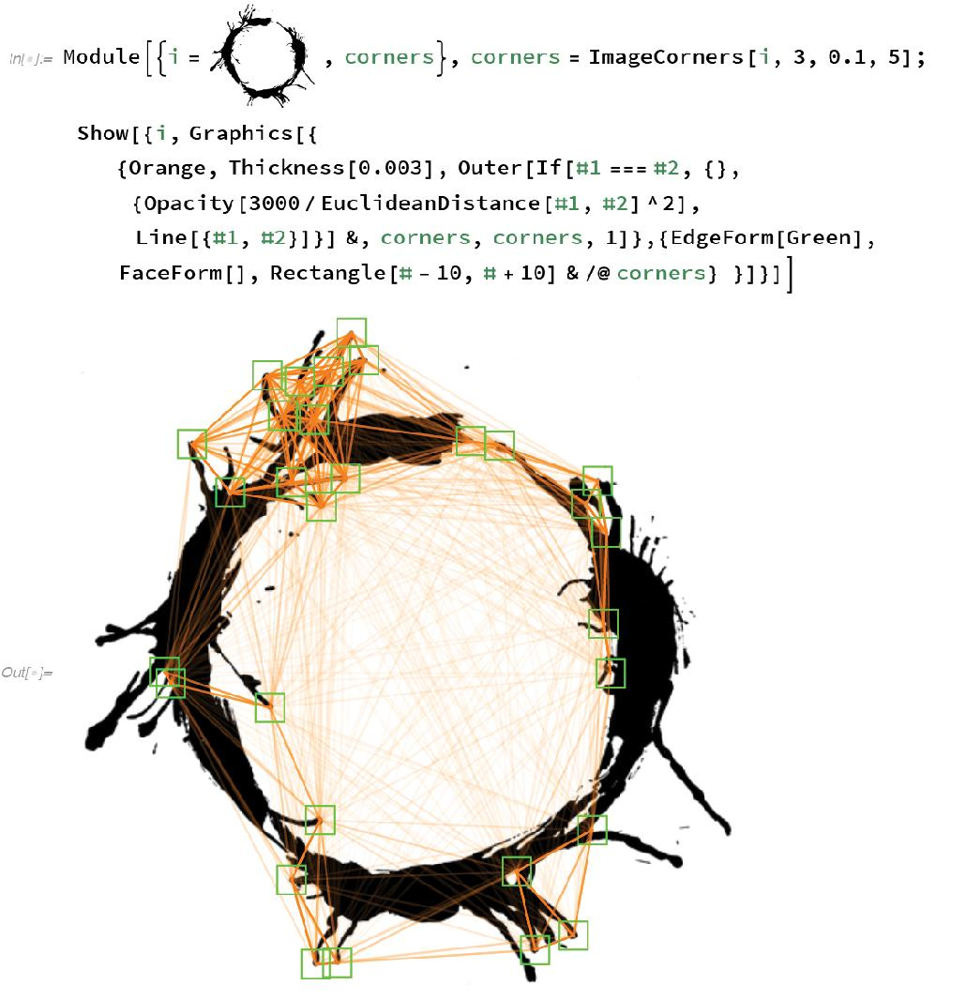
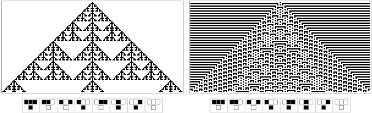

# 序言

人们会问我：“你工作那么努力……但是你平时做什么消遣呢？”事实上，我尽量让自己的生活安排得让我觉得工作就是一种乐趣。我所从事的大多数事情都与我长期以来构想的重大计划、我建立的产品、公司和科学理论密切相关。但有时我会着手处理一些突发事件，或者因为某些原因觉得有趣而投入其中。

这本书是我在过去十几年里写的一些文章的集合，以及围绕这些文章所发生的冒险。我大多数时候都是针对特定的情况或事件写作这些文章的。它们的主题多种多样。但令人惊讶的是，它们最终如何联系在一起。从某种程度上说，它们都反映了我一生中定义思维范式的范围。

所有这些都围绕着计算的概念以及它所引导的抽象的普遍性。无论我是在思考科学、技术、哲学还是艺术，计算范式都为我的思考提供了整体框架和具体事实。从某种意义上说，这本书反映了这种计算范式的适用广度。

但我想它也反映了我长期以来在自己身上培养的另一种品质：一种愿意和兴趣，即将我的思维方式应用于几乎任何话题。有时我会想象我对某个特定话题并没有太多可以添加的内容。但令人惊讶的是，计算范式——以及我对它的思考方式——往往会提供新的、不同的见解，或者意想不到的前进方向。

我经常敦促人们在面对看似不属于自己专业领域的问题时也要“保持思维活跃”。我自己也会这样做。计算范式的广泛性帮了我很多。但即使在一个更具体的层面上，我总是对我从科学、语言设计、技术开发或商业中学到的东西与出现的问题有多么紧密相连感到惊讶。

如果有一件事我希望从这本书的文章中能传达出来，那就是发现事物并深入理解特定主题和问题有多么有趣。有时候会有一个简单、肤浅的答案。但对我来说，真正令人兴奋的是在给出一个合适、基础的答案时所涉及的更为严肃的知识探索。当需要解决一个非常实际的问题时，但要达到一个好的解决方案却需要一次贯穿深刻且常常涉及哲学问题的探险，我总是觉得特别有趣。

不可避免地，这本书反映了我的个人历程。当我年轻的时候，我以为我的生活将完全围绕着在特定科学领域做出发现。但我渐渐意识到——尤其是在接受了计算范式之后——相同的思维过程不仅可以应用于人们通常认为的科学领域，而且几乎可以应用于任何事物。对我来说，看到这种情况是如何发生的带来了巨大的满足感。


# "快，外星飞船可能是如何工作的？

2016年11月10日


## 与好莱坞接洽

“这是一个有趣的剧本，”我们公关团队的一位人说道。我们经常收到电影制片人关于在电影中展示我们的图形、海报或书籍的请求。但这次的请求有所不同：我们能否紧急帮助制作一个大型好莱坞科幻电影的逼真屏幕显示，该电影即将开始拍摄？

嗯，在我们公司，不寻常的问题最终会出现在我的收件箱中，这次也不例外。现在偶然间，出于放松和专业兴趣的结合，我可能已经看过过去几十年里出现的基本上所有主流科幻电影。但仅仅根据暂定的片名（“你的生命故事”），我甚至不清楚这部电影是科幻片，还是什么。

但后来我听说它是关于与外星人的第一次接触，于是我说：“当然，我会读剧本的。” 是的，这是一个有趣的剧本。复杂，但有趣。我无法确定实际电影是大部分是科幻还是大部分是爱情故事。但其中肯定有有趣的与科学相关的主题——虽然掺杂着一些看起来毫无道理的事情，以及一些小的科学错误。

当我观看科幻电影时，我必须说我经常会感到不安，心想，“有人花了1亿美元拍了这部电影——然而他们却犯了一些毫无必要的科学错误，如果他们只是问了正确的人，这些错误早就可以修正了。”因此，我决定尽管我非常忙碌，我应该参与现在称为《来到》的电影，并亲自尽力为它提供最好的科学。

我认为，好莱坞电影通常没有得到应有的科学输入有几个原因。首先，电影制作者通常对电影的“科学质感”不够敏感。他们可以感觉到故事在人类层面上是否失调，但通常无法判断是否存在科学上的错误。有时他们会打电话给当地的大学寻求帮助，但往往会被送到一个过于专业化的学术界人士那里，他们并不能很有用地告诉他们整个故事是错误的。当然，公平地说，科学内容通常不会决定电影的成败。但我认为拥有良好的科学内容——就像拥有良好的布景设计一样——可以帮助一部好电影成就伟大。

作为一家公司，我们在与好莱坞合作方面积累了一定的经验，例如为电视剧《数字迷案》的六个季度编写了所有的数学内容。我个人没有参与其中——尽管我有一些科学朋友曾帮助过电影的制作。比如杰克·霍纳（曾在《侏罗纪公园》中工作），他（就他所说的）几乎在电影中呈现了他所有的古生物学理论，包括那些后来被证明是错误的理论。然后是基普·索恩（因最近成功探测到引力波而闻名），他在80多岁时担任了《星际穿越》的首席设计师，并使用Mathematica制作了最初的黑洞视觉效果。在较早的时代，还有马文·明斯基为《2001太空漫游》提供人工智能咨询，以及埃德·弗雷德金，他成为《战争游戏》中颇具个性的福尔肯博士的原型。最近，曼朱尔·巴尔加瓦（花了十年时间审视了《知无涯者》中的数学内容）在数周的编辑会议中仔细“观看了数学”。

所有这些人早在电影制作的早期就已经参与其中了。但我想，在电影即将开始拍摄时参与其中至少有一个优势，那就是你知道电影实际上会被制作出来（是的，在好莱坞关于这类事情的消息中，通常会有相当高的噪音与信号比）。这也意味着我的角色很明确：我所能做的就是尽力提升和调整科学内容；甚至根本不值得考虑改变剧情中的任何重要内容。

这部电影的灵感来自泰德·姜（Ted Chiang）于1998年创作的一篇有趣的短篇小说。但这是一个概念上复杂的故事，是基于数学物理中的一个相当技术性的概念——我并不是唯一一个在想着怎么可能把它拍成电影的人。尽管如此，这里有一个基本上实现了这一点的120页剧本，其中包含了原始故事的一些科学内容，以及相当多的增加内容，大部分仍处于“lorem ipsum”状态。因此，我开始工作，提出评论，建议修正等等。

## 几周后…

过了几周。我和儿子克里斯托弗来到了《到来》在蒙特利尔的拍摄现场。最新的X战警电影正在旁边一个巨大的设施拍摄。《到来》在一个更加适度的设施中。当我们到达时，他们正在直升机内部拍摄一个场景。我们看不见演员，但我们和几个制片人以及其他人一起在“视频村”监视器上观看。

我听到的第一句台词是：“我准备了一系列问题[给外星人]，从一些二进制序列开始……” 我就像，“哇，我建议说这句话！太棒了！” 但接着又来了另一次拍摄。一个词改变了。然后又来了更多的拍摄。是的，对话听起来更流畅了。但意思不对。我意识到：这比我想象的要困难得多。有很多权衡。有很多复杂性。（幸运的是，在最终的电影中，它最终是一个融合体，含有正确的含义，并且听起来很好。）

过了一会儿，拍摄休息了。我们和艾米·亚当斯（饰演一位被指派与外星人沟通的语言学家）交谈。她花了一些时间跟踪当地的语言学教授，并渴望讨论使用的语言对思维方式的影响这个问题——作为一名计算机语言设计师，我长期以来一直对此感兴趣。但制片人真正想要的是我和杰瑞米·雷纳（饰演电影中的一位物理学家）交谈。当时他感觉有些不舒服——于是我们去看了他们建造的“科学帐篷”布景，并思考哪些视觉效果会与之契合。


## 编写代码

剧本清楚地表明，将会有许多展现有趣视觉效果的机会。尽管我可能觉得这很有趣，但我个人实在没有时间去创造它们。幸运的是，我的儿子克里斯托弗——一个非常快速和富有创造力的程序员——对此很感兴趣。我们本来希望他能去片场工作一两个星期，但最终决定他还太年轻，因此他开始远程工作。

他的基本策略很简单，就是问：“如果我们是真的在做这个，我们会做什么分析和计算？” 我们有外星人着陆点的列表；其中有什么模式？我们有关于飞船形状的几何数据；它的意义是什么？我们有外星人的“手迹”；这意味着什么？


电影制片人向克里斯托弗提供了原始数据，就像在现实生活中一样，而他正在尝试对其进行分析。他将每个提出的问题转化为各种Wolfram语言代码和可视化工具。

克里斯托弗清楚地知道在电影中显示的代码通常没有意义（不管上下文如何，一个经常出现的例子似乎是Linux中nmap.c的源代码）。但他想要创建有意义的代码，并且实际上会执行电影中进行的分析。




在最终的电影中，屏幕的视觉效果是克里斯托弗创建的、从他所创建的中衍生出来的，以及单独放置的效果的混合物。偶尔可以看到代码。比如，有一个很好的镜头是重新排列外星人的“手迹”，其中可以看到一个带有相当优雅的Wolfram语言代码的Wolfram语言笔记本。是的，这些代码行实际上确实执行了笔记本中的变换。这是真实的东西，进行了真实的计算。

## 星际旅行理论

当我第一次开始研究电影剧本时，我很快意识到为了提出连贯的建议，我真的需要提出一个关于可能发生的事情的科学的具体理论。不幸的是，时间不多——最后，我基本上只有一个晚上来想出星际空间旅行可能如何工作的具体理论。以下是我当晚为电影制片人所写的部分内容（为了避免剧透，我不会展示更多内容）：


显然，所有这些物理细节在电影中并不是直接需要的。但仔细思考它们对于就剧本提出一致性建议确实非常有用。它们也引发了各种科幻对话的想法。以下是一些（可能是为了更好）没有出现在最终剧本中的想法：“整艘飞船就像一个巨大的量子粒子穿越太空”。 “外星人必须直接在普朗克尺度上操纵时空网络”。 “飞船表面周围存在时空湍流”。 “就像飞船表面有无数种类型的原子，不仅仅是我们知道的115种元素”（这与用单色激光照射飞船然后看到它呈彩虹返回有关）。对于我这样的“真正科学家”来说，想出这样的想法是有趣的。这有点解放人的感觉。特别是因为每一个这样的科幻对话都可以引导人进入一场长而严肃的物理讨论。

对于电影，我想要一个特定的星际旅行理论。谁知道，也许在遥远的未来的某一天它会被证明是正确的。但截至目前，我们当然不知道。事实上，据我们所知，现有的物理学可能只是存在一些简单的“黑客”技巧，可以立即实现星际旅行。例如，甚至还有我在1982年做过的一些工作暗示着，使用标准量子场论，几乎是矛盾的，我们应该能够持续地从真空中提取“零点能量”。多年来，这种基本机制已成为可能是星际旅行最常被引用的潜在推进源，即使我本人实际上并不相信它。（我认为它太过理想化了材料。）

也许（最近变得流行）至少有一种更为平凡的方法可以推动一个微小的航天器，即通过激光辐射压力将其推向附近的恒星。或者也许有一种方法可以进行“黑洞工程”，在标准的爱因斯坦引力理论中设置适当的时空扭曲。重要的是要意识到，即使我们知道了物理学的基本理论，我们仍然可能无法立即确定，例如在我们的宇宙中是否可能存在超光速的旅行。是否有一种方法可以设置一些量子场和黑洞等配置，使得事物表现得恰到好处？计算不可约性（与不可判定性、哥德尔定理、停机问题等相关）告诉我们，配置可能需要多么复杂和难以设置是没有上限的。最终，我们可能会用尽宇宙历史中所有可能的计算量，甚至更多，试图发明所需的结构，却永远不确定它是否不可能实现。

## 物理学家是什么样子的？

当我们参观片场时，我们最终遇到了杰瑞米·雷纳。我们发现他坐在自己的拖车阶梯上抽着香烟，看起来完全就是我在一堆电影中看到的那个充满活力的动作冒险家。我在想要以何种最有效的方式来传达物理学家的样子。我觉得我应该就从物理学开始说起。所以我开始解释与电影相关的物理理论。我们谈论太空、时间、量子力学、超光速旅行等等。我加入了一些我从理查德·费曼那里听到的关于“在曼哈顿计划中做物理学”的故事。这是一场充满活力的讨论，我在想我展示了哪些举止——这些可能或可能不是物理学家的典型特征。（我不禁记起了奥利弗·萨克斯告诉我的他在《觉醒》之后看到罗宾·威廉姆斯拿捏了多少他的举止，只是短暂接触后，所以我在想杰瑞米在这几个小时里会从我这里学到什么。）

杰瑞米渴望了解科学如何与电影的情节发展相关联，以及外星人以及人类在不同阶段可能会有什么感觉。我试着谈谈在科学中解决问题的感觉。然后我意识到最好的方法实际上是通过做一些现场编码来展示一点。而且事实证明，根据剧本的写法，杰瑞米实际上应该在镜头前使用Wolfram语言（就像——我很高兴地说——很多现实生活中的物理学家那样）。

克里斯托弗展示了他为电影编写的一些代码，以及如何控制动态效果。然后我们开始谈论如何着手解决编码问题。我们进行了一些准备工作。然后我们开始了，进行了现场编码。这是我们制作的第一个例子——基于我们在与SETI或《接触》（书本版本）或其他一些相关的话题中讨论过的圆周率的数字：


## 与外星人说什么

《到来》部分关乎星际旅行。但更多的是关于一旦外星人出现在这里，我们将如何与他们交流。我实际上对外星智慧思考过很多。但我大多是在一个比《到来》中更为困难的情况下思考的——在那里没有外星人或太空船的迹象，我们唯一拥有的只是一些薄弱的数据流，比如来自无线电传输，甚至很难知道我们所拥有的东西是否应该被视为“智能”的证据（请记住，例如，天气通常看起来都足够复杂，好像它“有自己的思维”）。

但在《到来》中，外星人就在这里。那么我们应该如何开始与他们交流呢？我们需要一些不依赖于人类语言或人类历史细节的普遍东西。好吧，如果你就在外星人旁边，就有物理物体可以指向。（是的，这假设外星人有离散对象的概念，而不仅仅是一个连续体，但当他们拥有太空船等设备时，这似乎是一个相当安全的打赌。）但如果你想更抽象呢？

那么，数学永远是个选择。但数学实际上是普遍的吗？建造太空船的人一定要了解质数、积分或傅立叶级数吗？在我们人类技术发展的过程中，我们需要理解这些东西。但是是否有其他（也许更好的）通向技术的途径呢？我认为是的。

对我来说，似乎与我们宇宙实际运作相关的最一般形式的抽象是通过观察可能程序的计算宇宙得到的。我们所实践的数学确实出现在那里。但是同样出现了无穷多其他抽象规则的集合。我意识到的是，其中许多对于生产技术来说非常相关，实际上非常有效。

所以，好吧，如果我们跨越可能程序的计算宇宙，我们可能会挑选出什么作为与来访的外星人开始抽象讨论的合理普遍概念？

一旦能指向离散对象，就有可能开始讨论数字，首先是一元的，然后可能是二元的。以下是我为电影制作的有关此内容的笔记本的开头部分。文字和代码是供人类阅读的；对于外星人来说，主要的图形只会是“闪卡”：


好的，那么在基本数字和可能的一些算术之后，接下来是什么？有趣的是意识到，即使到目前为止我们讨论的内容并不反映人类数学的历史：尽管它们是多么基础（以及它们在诸如《易经》之类的非常古老的传统中的出现），二进制数字直到相当近的时候才变得流行——远远晚于许多更难解释的数学理念。

我们不需要遵循人类数学或科学的历史——或者说，它教给人类的顺序，但我们确实需要找到一些可以非常直接理解的东西——不需要外部知识或语言。例如，如果我们在某次考古挖掘中无上下文地发现它们，我们会认出它们是什么。

很巧合的是，有一类我研究了几十年的计算系统，我认为它们非常适合这个要求：元胞自动机。它们基于简单的规则，容易用可视化方式显示出来。它们通过反复应用这些规则工作，并且通常生成复杂的图案——我们现在知道可以将其用作各种有趣技术的基础。



通过研究元胞自动机，人们实际上可以开始建立一个完整的世界观，或者就像我在写的关于这类事物的书中所称的那样，《一种新的科学》。但是，如果我们想要传达更传统的人类科学和数学观念呢？那我们该怎么做呢？

也许我们可以从展示二维几何图形开始。


高斯在大约1820年左右建议，人们可以在西伯利亚的森林中雕刻出一个标准的视觉图，用来展示毕达哥拉斯定理，供外星人观看。

然而，很容易陷入麻烦。我们可能会考虑展示柏拉图立体体。是的，3D打印品应该有效。但是二维透视渲染取决于我们特定的视觉系统上的许多细节。网络甚至更糟：我们怎么知道连接节点的那些线表示的是抽象连接？

人们可能会考虑逻辑：也许可以开始展示逻辑的真理定理。但是如何呈现它们呢？不知何故，人们必须有一种符号表示：文本、表达树或其他什么东西。根据我们现在对计算知识的了解，逻辑并不是表示一般概念的特别好的全局起点。但在1950年代，这一点并不清楚，有一本迷人的书（我的一本副本最终出现在了《到来》的片场上），试图用逻辑建立一种与外星人交流的整个方式：


那么数字呢？在《星际之门》（电影）中，质数是关键。尽管它们在人类数学史上很重要，但在今天的技术中，质数实际上并不是很常见，即使它们在某些情况下（比如在公钥密码系统中）出现，通常也似乎是偶然使用的。

在无线电信号中，质数乍看起来似乎是“智能证据”。但是当然，质数可以由程序生成——而且通常是相当简单的程序，包括例如元胞自动机。因此，如果看到一系列质数，并不意味着其中有一个精心设计的文明；它可能只是由一个某种方式“自然产生”的简单程序生成的。

可以很容易地通过视觉手段说明质数（至少作为无法以非平凡方式排列的对象的数量）。但是，进一步深入研究它们似乎需要一些不能如此直接表示的概念。

很容易陷入隐含地假设很多人类背景的情况。先驱者10号——比其他任何人类制造的物体都更远进入星际空间（目前大约110亿英里，约为阿尔法半人马距离的0.05%）——提供了我最喜欢的例子之一。宇宙飞船上有一块板，上面包括氢的21厘米谱线的波长的表示。现在，最明显的表示方法可能只是一条21厘米长的线。但是在1972年，卡尔·萨根等人决定采取“更科学的”方法，而是制作了导致谱线的量子机械过程的示意图。


问题在于，这个图表依赖于人类教科书的惯例，比如用箭头表示量子自旋，这些惯例与基础概念毫不相关，并且与科学发展的细节非常特定，碰巧适用于我们人类。

但是回到《到来》。要问一个问题，比如“你在地球上的目的是什么？”，就必须比只谈论二进制序列或元胞自动机要深入得多。这是一个非常有趣的问题，而且奇怪地类似于当前在世界上变得非常重要的一件事：与人工智能进行交流，并定义它们应该拥有的目标或目的（特别是“对人类友好”）。

在某种意义上，人工智能现在在地球上有点像外星智慧。到目前为止，我们唯一真正了解的智能是人类智能。但是不可避免地，我们看到的每个例子都共享人类条件和人类历史的所有细节。那么当智能不再共享这些细节时，智能会是什么样子呢？

嗯，从我所做的基础科学中得出的一个结论是，“智能”和仅仅“计算”之间实际上没有明显的界线。诸如元胞自动机或天气之类的事物正在进行与我们大脑一样复杂的活动。但是，即使在某种意义上它们正在“思考”，它们也不是以类似于人类的方式思考。它们不共享我们的背景和细节。

但是，如果我们要“沟通”关于目的之类的事情，我们必须找到一些方法来协调事物。在人工智能的情况下，事实上，我正在努力创建我所称的“符号对话语言”，这是一种表达对我们人类重要的概念，并将其传达给人工智能的方式。有短期的实际应用，比如建立智能合约。还有长期目标，比如定义人工智能应该如何行为的“宪法”类似物。

在与外星人沟通时，我们必须建立一个共同的“普遍”语言，使我们能够表达对我们重要的概念。这并不容易。人类的自然语言是基于人类条件和人类文明历史的特定情况。而我的符号对话语言实际上只是试图捕捉对人类重要的事物，而不是可能对外星人重要的事物。

当然，在《到来》中，我们已经知道外星人与我们分享了一些东西。毕竟，就像《2001太空漫游》中的石碑一样，即使从它们的形状上，我们也将外星人的飞船识别为工艺品。它们看起来不像奇怪的陨石之类的东西；它们看起来像是有意创造的东西。

但是为了什么目的？嗯，目的实际上不是可以抽象定义的东西。它实际上只能相对于一个完整的历史和文化框架来定义。因此，要问外星人他们的目的是什么，我们首先必须让他们了解我们运作的历史和文化框架。

我不禁思考，当我们把我们的人工智能发展到可以开始询问它们目的的程度时，会是什么样的情景。在某种程度上，我认为这将是令人失望的。因为，正如我所说的，我认为没有任何有意义的抽象目的定义。所以AI告诉我们的东西不会“令人惊讶”。它认为自己的目的只是它详细历史和背景的反映。在AI的情况下，作为它的终极创造者，我们恰好对此有相当大的控制权。

对于外星人来说，当然是另一回事。但这就是《到来》的一部分。

## 电影制作过程

我一生中花了大量时间做大项目——我总是很好奇任何大型项目是如何组织的。当我看电影时，我是那些会一直坐到字幕结束的人之一。因此，对我来说，在《到来》中更近距离地看到制作电影的项目非常有趣。

就规模而言，制作像《到来》这样的电影项目与发布Wolfram语言的重大新版本大致相同。很明显，它们存在一些相似之处，也有很多不同之处。

两者都涉及各种想法和创造力。两者都涉及整合各种不同类型的技能。两者都必须将一切组合在一起，以最终产生一个连贯的产品。

在某些方面，我认为电影制作人比我们软件开发人员更容易。毕竟，他们只需制作一个人们可以观看的东西。在软件——尤其是语言设计中——我们必须制作可以以无限多种不同方式使用的东西，包括我们无法直接预见的方式。当然，在软件中，您总是可以制作逐步改进事物的新版本；而在电影中，您只有一次机会。

而且就人力资源而言，软件开发比《到来》这样的电影显然更容易。良好管理的软件开发往往有一种相对稳定的节奏，因此可以让团队在数年间持续工作。在制作像《到来》这样的电影时，通常会短暂地聘请一系列人员——他们甚至可能从未见过面——每个人只负责很短的时间。对我来说，这种方式能够运作真是令人惊讶。但我想多年来，电影行业的许多任务已经足够标准化，以至于一个人可以在一两周内做点事情，然后成功地交给另一个人。

我一生中带领了几十个重大软件发布项目。人们可能会认为到现在我应该已经能够做出一个平静而简单的软件发布过程。但事实并非如此。也许是因为我们总是试图做一些全新和创新的事情。或者也许这就是这类项目的本质。但我发现，要将项目完成到我想要的质量水平，总是需要非常高度的个人投入。是的，至少在我们公司的情况下，总是有非常有才华的人在项目上工作。但不知何故总会有一些意想不到的事情要做，而且需要大量的精力、专注力和推动力才能将它们全部整合起来。

有时，我想象这个过程可能有点像制作电影。事实上，在Mathematica的早期年份，我们甚至还有看起来非常像电影片尾字幕的“软件制作人员表彰”——只是贡献者的类别通常是由我“编造”的（“主要包开发人员”、“表达式格式化”、“主要字体设计师”等等）。但是十年左右过去后，认识到对不同版本的贡献的拼凑变得太复杂了，因此我们不得不放弃了软件制作人员表彰。尽管如此，有一段时间我认为我们可以尝试举办“派对”，就像电影一样。但不知何故，当安排好的派对到来时，总会出现一些关键的软件问题，主要贡献者无法参加派对，因为他们要去解决这些问题。

软件开发——或至少是语言开发——与制作电影也有一些结构上的相似之处。首先是从剧本开始——总体上规定了最终产品的样子。然后就是实际尝试构建它。然后，不可避免地，在最后当我们看到我们拥有的东西时，我们意识到我们必须改变规范。在像《到来》这样的电影中，这是后期制作。在软件中，这更像是开发过程的迭代。

看到我提出的剧本和建议是如何通过《到来》的制作传播的，对我来说是很有趣的。这让我很想起我至少是如何进行软件设计的：一切都变得越来越简单。我会建议一些详细的方法来修复一段对话。“你不应该说[艾米·亚当斯角色]不及格的微积分；她的分析能力太强了。”“你不应该说太空船来自一百万光年外；那是在银河系之外的；改成一万亿英里。”更改会被做出。但然后事情会变得更简单，核心思想会以一种更为简洁的方式传达出去。我没有看到所有的步骤（尽管那会很有趣）。但结果让我很想起我已经做了很多次的软件设计过程——尽可能地去除任何复杂性，并使一切尽可能清晰和简洁。

## 你能写一个白板吗？

我的《到来》的贡献主要集中在电影于2015年夏初拍摄时期。几乎一年来，我一直听说电影正在“后期制作”。但突然在今年五月，我收到一封电子邮件：我是否能够紧急在白板上写一些相关的物理内容给电影？

有一个场景是艾米·亚当斯站在白板前，但奇怪的是当拍摄这个场景时，白板上写的内容是基本的高中物理，而不是像电影中的杰瑞米·雷纳角色那样的顶尖物理学。

有些有趣的是，我想我以前几乎没有在白板上写过什么东西。我在过去30多年里几乎所有的工作和演示都是用电脑完成的，而在此之前，主要的技术是黑板和幻灯片透明片。尽管如此，我在办公室里配备了一个白板，并开始写一些我想象中一个好的物理学家可能会想到的东西，如果他们试图理解一个刚刚出现的星际飞船。

以下是我想出的内容。白板上的大空白区域是为了更容易地将艾米·亚当斯（特别是她的头发）在白板前移动的镜头叠加在一起。（最后，白板又一次被重写，所以这里的内容并不详细说明电影中的情况。）


在写白板时，我想象它是杰瑞米·雷纳角色或他的同事们记录有关飞船的重要想法和相关公式的地方。不久之后，我得到了相当多的物理事实和推测。

以下是关键：


```
（1）也许飞船之所以具有其奇怪的（这里是糟糕的绘制）像回响般的形状，是因为它在飞行时会旋转，从而在时空中产生引力波。

（2）也许飞船的形状以某种方式优化，以产生最大强度的某种引力辐射模式。

（3）这是爱因斯坦原始公式，用于描述由于质量分布的变化而发出的引力辐射的强度。Qij 是分布的四极矩，由所示的积分计算得出。

（4）还有高阶项，这些项取决于由飞船质量密度ρ(Ω)加权的球谐函数计算得出的高阶多极矩。

（5）引力波会导致时空结构的扰动，由 4 维张量hμν表示。

（6）也许飞船以某种方式在时空中“游动”，被这些引力波的效应推动。

（7）也许在飞船的外壳周围，时空结构中存在“引力湍流”，具有像流体中运动物体周围看到的湍流一样的幂律相关性。（或者也许飞船只是在其周围“沸腾时空”……）

（8）这是普帕普特方程，描述自旋张量在广义相对论中随固有时间τ演变的情况。

（9）描述物体在（可能是弯曲的）时空中移动的测地线运动方程。Γ 是由时空结构确定的克里斯托夫符号。是的，可以使用 Wolfram 语言中的 NDSolve 解决这类方程。

（10）爱因斯坦的引力场方程，描述了由运动质量产生的引力场（该场确定了质量的运动，进而反作用于改变场）。

（11）另一种想法是，飞船可能以某种方式具有负质量，或至少具有负压力。光子气体的压力为1/3 ρ；最常见的暗能量版本将具有压力-ρ。

（12）能量-动量张量的方程，指定了在完美流体的相对论计算中出现的质量、压力和速度的组合。

（13）也许飞船代表着一种“泡沫”，其中时空结构是不同的。（箭头指向了事先在白板上绘制的示意飞船形状。）

（14）克里斯托夫符号（“切丛束上的联络的系数”）对于飞船的形状是否有特殊之处，可以从其空间度量张量计算出来？

（15）引力波可以被描述为相对于平坦背景闵可夫斯基空间的时空度量的扰动。

（16）考虑到引力波对其自身的前几个“非线性”效应，引力波传播的方程。

（17）描述玻色-爱因斯坦粒子气体中运动（“传输”）和碰撞的相对论玻尔兹曼方程。

（18）一个遥远的想法：也许有一种使用引力子而不是光子的“激光”的方法，也许这就是飞船的工作原理。

（19）激光是量子现象。这是一个关于引力子自相互作用的费曼图示例，它是一个腔中引力子的自相互作用。（光子没有这种直接的“非线性”自相互作用。）

（20）如何制作引力子的镜子？也许可以制造一个从微观结构一直到普朗克尺度的微观结构的变材料。

（21）激光包括由量子场论真空中的无穷嵌套的产生算符形成的无穷叠加的相干态。

（22）有一个关于此的费曼图：这是一个关于引力子束缚态的贝特-萨尔彼得类型的自洽方程（我们不知道是否存在），这可能与引力子激光有关。

（23）量子引力的微扰近似中引力子的基本非线性相互作用。

（24）从量子效应的角度来看，爱因斯坦-希尔伯特行动的可能修正项。
```

呃，我能理解这些解释可能看起来像是另一种外星语言！不过，与“完全的物理术语”相比，它们实际上还算相对温和。但让我解释一下白板上的“物理故事”。

故事始于飞船显而易见的特征：它相当不寻常、不对称的形状。它看起来有点像那种可以朝一个方向开始旋转，然后改变方向的响板顶。所以我想：也许飞船在旋转。嗯，任何一个大型（非球形）物体旋转都会产生引力波。通常情况下，它们太微弱以至于无法检测到，但如果物体足够大或旋转足够迅速，它们就可能很显著。事实上，去年底，在经历了30年的历程后，从旋转并合并的两个黑洞中探测到了引力波，并且它们的强度足以在宇宙三分之一的距离内被探测到。（加速的质量实际上会像加速的电荷产生电磁波一样产生引力波。）

好的，那么让我们想象一下，飞船以某种方式迅速旋转，产生大量引力波。如果我们能够以某种方式将这些引力波限制在一个小区域内，甚至可以利用飞船本身的运动？那么，这些波将相互干涉。但是如果波被相干放大，就像激光中一样？那么，这些波将变得更强，它们不可避免地会对飞船的运动产生重大影响——比如推动它穿越时空。

但是为什么引力波会被放大呢？在使用光子（“光粒子”）的普通激光器中，基本上需要不断地通过向材料注入能量来制造新的光子。光子是所谓的玻色-爱因斯坦粒子（“玻色子”），这意味着它们倾向于“做同样的事情”——这就是为什么激光中的光以一种连贯的波形式出现的原因。（电子是费米子，这意味着它们试图永远不做同样的事情，导致排斥原理对于使物质稳定等方面至关重要。）

正如光波可以被认为是由光子组成的，引力波很可能可以被认为是由引力子组成的（尽管公平地说，我们还没有任何完全一致的引力子理论）。光子不会直接相互作用——基本上是因为光子与具有电荷的电子等物质相互作用，但光子本身并不具有电荷。另一方面，引力子会直接相互作用——基本上是因为它们与任何形式的能量相互作用，它们本身也能够具有能量。

这种非线性相互作用可能会产生疯狂的效果。例如，量子色动力学中的胶子具有非线性相互作用，使它们永久地被困在像质子这样的粒子内，将它们“粘”在一起。引力子的非线性相互作用会导致什么样的效果，目前完全不清楚。这里的想法是，也许它们会导致某种自持的“引力子激光”。

白板顶部的公式基本上是关于引力波的产生和效应。底部的公式大多与引力子及其相互作用有关。顶部的公式基本上都与爱因斯坦的广义相对论有关（这在过去100年里一直是物理学中使用的引力理论）。底部的公式提供了关于引力子及其相互作用的经典和量子方法的混合。图表是所谓的费曼图，其中波状线条形象地代表引力子在时空中传播。

我真不知道“引力子激光”是否可能存在，或者它是如何工作的。但在普通光子激光器中，光子始终在某种空腔内反弹，其壁作为镜子。然而，遗憾的是，我们不知道如何制造引力子镜子——就像我们不知道任何可以屏蔽引力场的方法一样（好吧，如果暗物质确实存在的话，它可能会起到这样的作用）。在白板上，我推测也许存在一种奇怪的方式，在普朗克尺度的10^-34米处（引力量子效应基本上变得重要的地方），可以制造一种作为引力子镜子的“变形材料”。（另一种可能性是引力子激光器可能更像一个没有真正空腔的自由电子激光器。）

现在，请记住，我在白板上的想法是写下我认为典型的好物理学家，比如从政府实验室挑选出来的人，如果面对电影中的情况会想到的事情。它比我个人为制作星际飞船所想出的理论更“传统”。但这是因为我的理论取决于我对基本物理原理的一些想法，这些想法在物理学界尚不被广泛接受。

星际旅行的正确理论是什么？毫无疑问，我不知道。如果我为电影创造的主要理论或白板上的理论在目前的状态下是正确的，我会感到惊讶。但谁知道呢？当然，如果一些外星人乘坐星际飞船出现，甚至向我们展示星际旅行是可能的，那将非常有帮助...

## 你们在地球的目的是什么？

如果外星人出现在地球上，一个显而易见的重大问题是：你们为什么在这里？你们的目的是什么？这是《到来》中的角色经常讨论的话题。当克里斯托弗和我访问拍摄现场时，我们被要求列出可能的答案，可以写在白板或剪贴板上。以下是我们想出的答案：


正如我之前提到的，整个目的的概念与文化和其他背景密切相关。想想在人类历史的不同时期，人们会将什么样的目的列入这个列表，这是很有趣的。想象一下未来人类、人工智能或外星人可能会为未来的事情给出什么目的也很有趣。也许我过于悲观，但我相当期待未来人类、人工智能和外星人的答案往往会是计算宇宙中的某种可能性——而我们今天甚至连用词或概念都无法描述。

## 现在它成为了一部电影...

这部电影真的很成功，早期的反响看起来很不错……看到这样的东西真是太有趣了（是的，那是克里斯托弗的代码）:


参与《Arrival》的过程非常有趣和激动人心。这让我更多地了解了创作所有那些我看过的电影所需的一切，以及将科学与引人入胜的虚构融合在一起需要什么。它还促使我提出了一些比以往任何时候都更多的科学问题，但这些问题与我感兴趣的各种事物都有关。

但在这一切过程中，我忍不住在想：“如果这是真的，外星人真的来到了地球会怎样？”我希望参与《Arrival》的经历让我对此有了一些准备。当然，如果他们的飞船碰巧看起来像巨大的黑色摇摆玩具，那么我们甚至已经有了一些不错的 Wolfram 语言代码...

